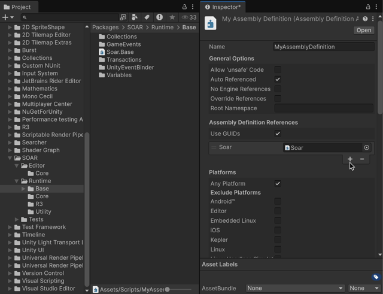

# Base Classes

SOAR provides a set of pre-defined, concrete "Base Classes" for its core features, such as `Variable`, `GameEvent`, and `Collection`.
These are ready-to-use `ScriptableObject` assets for common data types (e.g., `int`, `float`, `string`, `Vector3`), allowing developers to use SOAR's features immediately without writing boilerplate code.
They are located in the separate `Soar.Base` assembly, which may require adding an assembly definition reference.

## Using Base Classes

To use the pre-defined Base Classes, make sure that the project's assembly definition file (`.asmdef`) has a reference to `Soar.Base`.

1.  **Locate the Assembly Definition File**: Find the `.asmdef` file in the project that governs the scripts where Base Classes would be used. If there's none, create one by right-clicking in the Project window and selecting `Create > Assembly Definition`.

2.  **Add the Reference**: Select the `.asmdef` file to open it in the Inspector. In the "Assembly Definition References" section, click the `+` button and add `Soar.Base`.

    
4
3.  **Apply Changes**: Click "Apply" to save the changes.

Once the reference is added, create instances of these Base Classes directly from the Unity Editor's context menu.

!!! Note "Default Assembly-CSharp"
    If there are no specified asmdef file on the project, SOAR's Base Classes can be automatically referenced by scripts. This is pretty useful for prototyping, but not recommended for production.

## Available Base Classes

The Base Classes are organized in the `Assets > Create > SOAR` menu, under their respective feature categories.

### GameEvents

Parameterless and typed `GameEvent`s for common data types can be found under `Assets > Create > SOAR > Game Events`.

-   **Parameterless**:
    - `GameEvent` (for simple signals)
-   **Primitive Types**:
    - `BoolGameEvent`
    - `ByteGameEvent`
    - `DoubleGameEvent`
    - `FloatGameEvent`
    - `IntGameEvent`
    - `LongGameEvent`
    - `StringGameEvent`
-   **Unity Types**:
    - `AudioClipGameEvent`
    - `GameObjectGameEvent`
    - `PoseGameEvent`
    - `QuaternionGameEvent`
    - `Texture2DGameEvent`
    - `Vector2GameEvent`
    - `Vector3GameEvent`

These are useful for broadcasting events like "PlayerDied" (`GameEvent`), "ItemCollected" (`StringGameEvent` with item name), or "PlaySound" (`AudioClipGameEvent`).

### Variables

Commonly used variable types are available under `Assets > Create > SOAR > Variables`.

-   **Primitive Types**:
    - `BoolVariable`
    - `ByteVariable`
    - `DoubleVariable`
    - `FloatVariable`
    - `IntVariable`
    - `LongVariable`
    - `StringVariable`
-   **Unity Types**:
    - `CameraVariable`
    - `ColorVariable`
    - `GameObjectVariable`
    - `PoseVariable`
    - `QuaternionVariable`
    - `TransformVariable`
    - `Vector2Variable`
    - `Vector3Variable`

These variables can be used to store and react to changes in shared data, such as player health (`FloatVariable`), score (`IntVariable`), or player name (`StringVariable`).

### Collections (Lists)

SOAR provides pre-defined list collections under `Assets > Create > SOAR > Lists`.

-   **Primitive Types**:
    - `BoolList`
    - `ByteList`
    - `DoubleList`
    - `FloatList`
    - `IntList`
    - `LongList`
    - `StringList`
-   **Unity Types**:
    - `AudioClipList`
    - `ColorList`
    - `PoseList`
    - `QuaternionList`
    - `SpriteList`
    - `Vector2List`
    - `Vector3List`

These lists are useful for managing dynamic collections of items, such as a list of active enemies (`GameObjectList`), a playlist of songs (`AudioClipList`), or a sequence of tutorial steps (`StringList`).

!!! Note "Dictionary as Custom Class only"
    Currently, only `List` collections are provided as Base Classes. For `Dictionary` collections, create custom class inheriting from `SoarDictionary<TKey, TValue>`.

### Transactions

Base `Transaction` types are available under `Assets > Create > SOAR > Transactions`.

-   **Parameterless**:
    - `Transaction` (for simple request-response signals)
-   **Symmetric Typed**:
    - `BoolTransaction`
    - `ByteTransaction`
    - `DoubleTransaction`
    - `FloatTransaction`
    - `IntTransaction`
    - `LongTransaction`
    - `PoseTransaction`
    - `QuaternionTransaction`
    - `StringTransaction`
    - `Vector2Transaction`
    - `Vector3Transaction`

These transactions use the same type for both the request and the response (eg., `IntTransaction` is `Transaction<int, int>`). They are useful for operations that take a value, process it, and return a modified value of the same type. For asymmetric typed create custom class that inherits from `Transaction<TRequest, TResponse>` as necessary.

## Creating Custom Classes

While SOAR provides a wide range of Base Classes, a custom data types specific to the project are often required. This process is straightforward and follows the same pattern for all SOAR features.

For example, to create a `Variable` for a custom `PlayerData` struct:

1.  **Define the Data Type**: Make sure custom data type is `[Serializable]`.

    ```csharp
    // File: PlayerData.cs
    using System;

    [Serializable]
    public struct PlayerData
    {
        public string name;
        public int level;
        public float health;
    }
    ```

2.  **Create the Variable Class**: Create a new class that inherits from `Variable<T>`.

    ```csharp
    // File: PlayerDataVariable.cs
    using Soar;
    using Soar.Variables;
    using UnityEngine;

    [CreateAssetMenu(fileName = "PlayerDataVariable", menuName = MenuHelper.DefaultVariableMenu + "Player Data Variable")]
    public class PlayerDataVariable : Variable<PlayerData> { }
    ```

3.  **Create the Asset**: Create `PlayerDataVariable` assets from the `Assets > Create > SOAR > Variables > Player Data Variable` menu.

This same process applies to creating custom `Command`s, `GameEvent`s, `Collection`s, and `Transaction`s.
