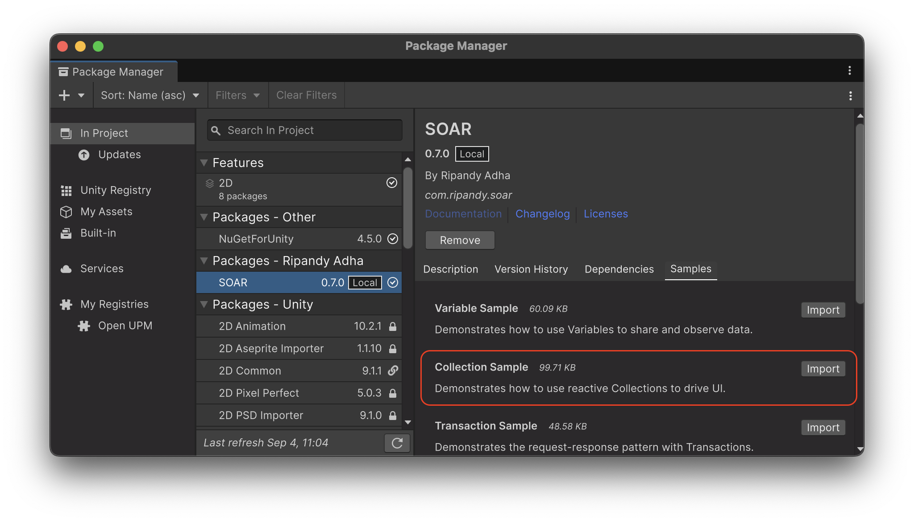

# Collection

SOAR の `Collection` 機能は、`SoarList<T>` や `SoarDictionary<TKey, TValue>` のような、リアクティブな `ScriptableObject` ベースのコレクションを提供します。
これらのアセットにより、共有され、監視可能なデータ構造を簡単に作成し、管理・監視することができます。
`IList` や `IDictionary` のような一般的なインターフェースを実装することで、使い慣れた API を提供し、LINQ と完全に互換性があります。さらに、アイテムが追加、削除、または更新されたときに追加のイベントがトリガーされます。

## コアコンセプト

`Collection<T>` は、すべての SOAR コレクションのコア機能を提供する抽象基本クラスです。


- **リアクティブイベント**: コレクションが変更されると、サブスクライバーに通知します。要素の追加、削除、クリア、または変更のイベントにサブスクライブできます。
- **インスペクターでの編集**: コレクションの内容は Unity インスペクターで直接表示および変更できるため、初期データの設定が簡単です。
- **値の自動リセット**: 有効にすると、再生モードが終了したときにコレクションが自動的に初期状態に戻ります。これは、インスペクターの `autoResetValue` フィールドで制御されます。
- **値イベントタイプ**: この設定は、値変更イベントがいつ発生するかを決定します：
    - `ValueAssign`: 現在の値と同じであっても、値が設定されるたびにイベントが発生します。
    - `ValueChanged`: 新しい値が現在の値と異なる場合にのみイベントが発生します。

!!! Note "シリアル化された型"
    Unity のシリアル化の動作により、`autoResetValue` は構造体およびプリミティブ型で最も信頼性があります。クラス型の場合、初期状態はシャローコピーです。リスト内のオブジェクトを変更すると初期状態が変更され、リセット時に予期しない動作を引き起こす可能性があります。

## `SoarList<T>`

`SoarList<T>` は、標準の `List<T>` に似た、順序付けられた要素のコレクションです。
`IList<T>` および `IReadOnlyList<T>` を実装し、インデックスによるアクセス、`Insert`、`RemoveAt` などの使い慣れたリスト操作を提供します。
`SoarList<T>` は、アクティブなパワーアップのリストやウェイポイントのシーケンスなど、ゲームの異なる部分間でデータを共有するためにリアクティブなリストが必要な場合に便利です。

## `SoarDictionary<TKey, TValue>`

`SoarDictionary<TKey, TValue>` は、`Dictionary<TKey, TValue>` を反映したキーと値のペアのコレクションです。
`IDictionary<TKey, TValue>` および `IReadOnlyDictionary<TKey, TValue>` を実装し、効率的なキーベースのデータ取得と変更を可能にします。
プレイヤーのインベントリ（キーがアイテム ID で値がアイテムオブジェクト）の管理やゲーム設定の保存などのシナリオに最適です。

## コレクションの作成

SOAR には、一般的なデータ型（例：`IntList`、`StringList`）用の事前定義された `List` 型が含まれており、`Assets > Create > SOAR > Lists` メニューから作成できます。

!!! Note "アセンブリ定義参照"
    これらの一般的な型は `Soar.Base.asmdef` アセンブリで定義されています。これらを使用するには、プロジェクトのアセンブリ定義ファイルに `Soar.Base.asmdef` への参照を追加する必要があります。

カスタムデータ型のコレクションを作成するには、`SoarList<T>` または `SoarDictionary<TKey, TValue>` から継承する新しいクラスを定義する必要があります。

### カスタムリストの例

1.  カスタムデータ型は `[Serializable]` としてマークする必要があります。
    
    ```csharp
    // File: MyItem.cs
    using System;

    [Serializable]
    public struct MyItem
    {
        public string itemName;
        public int itemID;
    }
    ```

2.  `SoarList<T>` を継承する新しいクラスを作成する必要があります。

    ```csharp
    // File: MyItemList.cs
    using Soar;
    using Soar.Collections;
    using UnityEngine;

    [CreateAssetMenu(fileName = "MyItemList", menuName = MenuHelper.DefaultListMenu + "My Item List")]
    public class MyItemList : SoarList<MyItem> { }
    ```

3.  `MyItemList` のインスタンスは、`Assets > Create > SOAR > Lists > My Item List` メニューから作成できるようになります。

### カスタム辞書の例

カスタム辞書の作成も同じパターンに従います。

```csharp
// File: StringStringDictionary.cs
using Soar;
using Soar.Collections;
using UnityEngine;

[CreateAssetMenu(fileName = "StringStringDictionary", menuName = MenuHelper.DefaultCollectionMenu + "String-String Dictionary")]
public class StringStringDictionary : SoarDictionary<string, string> { }
```

## 変更のサブスクライブ

コレクションの変更は、そのイベントにサブスクライブすることで監視できます。メモリリークを防ぐために、不要になったサブスクリプションは常に破棄する必要があります。

```csharp
// File: CollectionMonitor.cs
using System;
using Soar.Collections;
using UnityEngine;

// IntList アセットが作成されていると仮定
public class CollectionMonitor : MonoBehaviour
{
    [SerializeField] private IntList targetList;
    private IDisposable addSubscription;
    private IDisposable removeSubscription;
    private IDisposable countSubscription;
    private IDisposable valueSubscription;

    private void Start()
    {
        if (targetList == null) return;

        // さまざまなイベントにサブスクライブ
        addSubscription = targetList.SubscribeOnAdd(OnItemAdded);
        removeSubscription = targetList.SubscribeOnRemove(OnItemRemoved);
        countSubscription = targetList.SubscribeToCount(OnCountChanged);
        valueSubscription = targetList.SubscribeToValues(OnValueChanged);

        Debug.Log($"Monitoring {targetList.name}. Initial count: {targetList.Count}");
    }

    private void OnDestroy()
    {
        // すべてのサブスクリプションを破棄
        addSubscription?.Dispose();
        removeSubscription?.Dispose();
        countSubscription?.Dispose();
        valueSubscription?.Dispose();
    }

    private void OnItemAdded(int newItem)
    {
        Debug.Log($"Item added: {newItem}");
    }

    private void OnItemRemoved(int removedItem)
    {
        Debug.Log($"Item removed: {removedItem}");
    }

    private void OnCountChanged(int newCount)
    {
        Debug.Log($"Count changed to: {newCount}");
    }

    private void OnValueChanged(int index, int newValue)
    {
        Debug.Log($"Value at index {index} changed to: {newValue}");
    }
}
```

## R3 との連携

`SOAR_R3` スクリプティング定義シンボルがアクティブな場合、SOAR コレクションは R3 ライブラリと統合され、強力なリアクティブプログラミング機能が利用可能になります。

### Observable ストリーム

`SoarList<T>` と `SoarDictionary<TKey, TValue>` の両方が、豊富な `Observe...()` メソッドを公開しています：

-   **`ObserveAdd()`**: 追加されたアイテムを発行します。
-   **`ObserveRemove()`**: 削除されたアイテムを発行します。
-   **`ObserveClear()`**: コレクションの `Clear()` メソッドが呼び出されたときに `Unit` 通知を発行します。
-   **`ObserveCount()`**: 変更されるたびにコレクションの新しい `Count` を発行します。
-   **`ObserveValues()`**: 既存の要素の値が変更されたときに通知を発行します。
    -   `SoarList<T>` の場合、`IndexValuePair<T>` を発行します。
    -   `SoarDictionary<TKey, TValue>` の場合、`KeyValuePair<TKey, TValue>` を発行します。

`SoarList<T>` には、リスト固有の操作のための追加のストリームがあります：
-   **`ObserveMove()`**: 値、古いインデックス、新しいインデックスを含む `MovedValueDto<T>` を発行します。
-   **`ObserveInsert()`**: 特定のインデックスにアイテムが挿入されたときに `IndexValuePair<T>` を発行します。

### Async/Await サポート

すべての `Observe...()` メソッドには、`ValueTask` を返す対応する `On...Async()` または `...Async()` があります。これにより、コレクションの次の特定の変更を `await` することができます。

-   **`OnAddAsync()`**: 次に追加されるアイテムを待機します。
-   **`OnRemoveAsync()`**: 次に削除されるアイテムを待機します。
-   **`OnClearAsync()`**: 次の `Clear()` 操作を待機します。
-   **`CountAsync()`**: コレクションの `Count` の次の変更を待機します。
-   **`ValuesAsync()`**: 要素の値の次の変更を待機します。

`SoarList<T>` の場合：
-   **`OnMoveAsync()`**: 次の移動操作を待機します。
-   **`OnInsertAsync()`**: 次の挿入操作を待機します。

### 例

```csharp
// R3 の例
#if SOAR_R3
using R3;
using Soar.Collections;
using UnityEngine;

// IntList アセットが作成されていると仮定
public class R3CollectionMonitor : MonoBehaviour
{
    [SerializeField] private IntList targetList;

    private void OnEnable()
    {
        if (targetList == null) return;

        // より表現力豊かで管理しやすいコードのために R3 Observable を使用
        targetList.ObserveAdd()
            .Subscribe(newItem => Debug.Log($"Item added: {newItem}"))
            .AddTo(this); // 自動破棄のための R3 拡張

        targetList.ObserveCount()
            .Subscribe(newCount => Debug.Log($"Count is now: {newCount}"))
            .AddTo(this);
    }
}
#endif
```

## エディタ統合

`Collection<T>` およびその派生クラスのカスタムエディタは、Unity インスペクターで使いやすいインターフェースを提供します。

- **要素リスト**: コレクションの内容がリスト形式で表示され、値を直接編集できます。
- **インスタンス設定**: 折りたたみセクションには、コレクションインスタンスの設定が含まれています：
  - `Value Event Type`: `ValueAssign` と `ValueChanged` を選択するためのドロップダウン。
  - `Auto Reset Value`: 再生モード終了時のコレクションデータの自動リセットを有効/無効にするためのチェックボックス。

## ライフサイクルと破棄

`SoarCore` の派生クラスとして、コレクションは管理されたライフサイクルに従います：

- **初期化**: ゲーム開始時またはドメインリロード後、コレクションの現在の状態が初期値として保存されます。
- **リセット**: `autoResetValue` が `true` の場合、再生モードが終了するとコレクションはこの初期状態に戻ります。`ResetValues()` メソッドはいつでも手動で呼び出すこともできます。
- **破棄**: アプリケーションが終了すると `Dispose()` メソッドが自動的に呼び出され、メモリリークを防ぐためにすべてのアクティブなサブスクリプションがクリアされます。

## サンプル使用法

この機能をテストするには、パッケージマネージャウィンドウから関連するサンプルパッケージをインポートできます。



The **Collection サンプル**は、`SoarList<int>` を使用して動的な UI を駆動する方法を示します。別のスクリプトからコレクションが変更されたときにビューを自動的に更新するために、追加、削除、および値変更イベントにサブスクライブする方法を示します。

詳細なセットアップと使用手順については、インポート後に `CollectionSamples` フォルダ内の `README.md` ファイルを参照してください。
