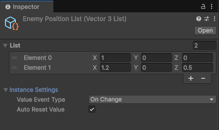

# Collection

The `Collection` feature in SOAR provides reactive, `ScriptableObject`-based collections like `SoarList<T>` and `SoarDictionary<TKey, TValue>`.
These assets allow for the creation of shared, observable data structures that are easily managed and monitored.
By implementing common interfaces like `IList` and `IDictionary`, they offer a familiar API and are fully compatible with LINQ, while additional events are triggered when items are added, removed, or updated.

## Core Concepts

`Collection<T>` is the abstract base class providing the core functionality for all SOAR collections.



- **Reactive Events**: Collections notify subscribers when they are modified. Subscriptions can be made to events for adding, removing, clearing, or changing elements.
- **Inspector Editing**: The contents of a collection can be viewed and modified directly in the Unity Inspector, making the setup of initial data straightforward.
- **Auto Reset Value**: When enabled, the collection automatically reverts to its initial state when play mode ends. This is controlled by the `autoResetValue` field in the Inspector.
- **Value Event Type**: This setting determines when a value change event is raised:
    - `ValueAssign`: The event is raised every time a value is set, even if it's the same as the current value.
    - `ValueChanged`: The event is raised only if the new value is different from the current value.

!!! Note "Serialized Types"
    Due to Unity's serialization behavior, `autoResetValue` is most reliable with structs and primitive types. For class types, the initial state is a shallow copy. Modifying objects within the list will alter the initial state, which can lead to unexpected behavior upon reset.

## `SoarList<T>`

`SoarList<T>` is an ordered collection of elements, similar to a standard `List<T>`.
It implements `IList<T>` and `IReadOnlyList<T>`, providing familiar list operations like indexed access, `Insert`, and `RemoveAt`.
`SoarList<T>` is useful when a reactive list is needed to share data between different parts of a game, such as a list of active power-ups or a sequence of waypoints.

## `SoarDictionary<TKey, TValue>`

`SoarDictionary<TKey, TValue>` is a collection of key-value pairs, mirroring `Dictionary<TKey, TValue>`.
It implements `IDictionary<TKey, TValue>` and `IReadOnlyDictionary<TKey, TValue>`, allowing for efficient key-based data retrieval and modification.
It is ideal for scenarios like managing a player's inventory (where the key is an item ID and the value is the item object) or storing game settings.

## Creating a Collection

SOAR includes pre-defined `List` types for common data types (e.g., `IntList`, `StringList`), which can be created from the `Assets > Create > SOAR > Lists` menu.

!!! Note "Assembly Definition Reference"
    These common types are defined in the `Soar.Base.asmdef` assembly. To use them, a reference to `Soar.Base.asmdef` must be added in the project’s assembly definition file.

To create a collection for a custom data type, a new class must be defined that inherits from `SoarList<T>` or `SoarDictionary<TKey, TValue>`.

### Custom List Example

1.  The custom data type must be marked as `[Serializable]`.
    
    ```csharp
    // File: MyItem.cs
    using System;

    [Serializable]
    public struct MyItem
    {
        public string itemName;
        public int itemID;
    }
    ```

2.  A new class inheriting from `SoarList<T>` should be created.

    ```csharp
    // File: MyItemList.cs
    using Soar;
    using Soar.Collections;
    using UnityEngine;

    [CreateAssetMenu(fileName = "MyItemList", menuName = MenuHelper.DefaultListMenu + "My Item List")]
    public class MyItemList : SoarList<MyItem> { }
    ```

3.  Instances of `MyItemList` can now be created from the `Assets > Create > SOAR > Lists > My Item List` menu.

### Custom Dictionary Example

Creating a custom dictionary follows the same pattern.

```csharp
// File: StringStringDictionary.cs
using Soar;
using Soar.Collections;
using UnityEngine;

[CreateAssetMenu(fileName = "StringStringDictionary", menuName = MenuHelper.DefaultCollectionMenu + "String-String Dictionary")]
public class StringStringDictionary : SoarDictionary<string, string> { }
```

## Subscribing to Changes

Changes to a collection can be observed by subscribing to its events. Subscriptions should always be disposed of when no longer needed to prevent memory leaks.

```csharp
// File: CollectionMonitor.cs
using System;
using Soar.Collections;
using UnityEngine;

// Assuming an IntList asset has been created
public class CollectionMonitor : MonoBehaviour
{
    [SerializeField] private IntList targetList;
    private IDisposable addSubscription;
    private IDisposable removeSubscription;
    private IDisposable countSubscription;
    private IDisposable valueSubscription;

    private void Start()
    {
        if (targetList == null) return;

        // Subscribe to various events
        addSubscription = targetList.SubscribeOnAdd(OnItemAdded);
        removeSubscription = targetList.SubscribeOnRemove(OnItemRemoved);
        countSubscription = targetList.SubscribeToCount(OnCountChanged);
        valueSubscription = targetList.SubscribeToValues(OnValueChanged);

        Debug.Log($"Monitoring {targetList.name}. Initial count: {targetList.Count}");
    }

    private void OnDestroy()
    {
        // Dispose all subscriptions
        addSubscription?.Dispose();
        removeSubscription?.Dispose();
        countSubscription?.Dispose();
        valueSubscription?.Dispose();
    }

    private void OnItemAdded(int newItem)
    {
        Debug.Log($"Item added: {newItem}");
    }

    private void OnItemRemoved(int removedItem)
    {
        Debug.Log($"Item removed: {removedItem}");
    }

    private void OnCountChanged(int newCount)
    {
        Debug.Log($"Count changed to: {newCount}");
    }

    private void OnValueChanged(int index, int newValue)
    {
        Debug.Log($"Value at index {index} changed to: {newValue}");
    }
}
```

## R3 Integration

If the `SOAR_R3` scripting define symbol is active, SOAR collections integrate with the R3 library, unlocking powerful reactive programming capabilities.

### Observable Streams

Both `SoarList<T>` and `SoarDictionary<TKey, TValue>` expose a rich set of `Observe...()` methods:

-   **`ObserveAdd()`**: Emits the item that was added.
-   **`ObserveRemove()`**: Emits the item that was removed.
-   **`ObserveClear()`**: Emits a `Unit` notification when the collection's `Clear()` method is called.
-   **`ObserveCount()`**: Emits the new `Count` of the collection whenever it changes.
-   **`ObserveValues()`**: Emits a notification when an existing element's value is changed.
    -   For `SoarList<T>`, this emits an `IndexValuePair<T>`.
    -   For `SoarDictionary<TKey, TValue>`, this emits a `KeyValuePair<TKey, TValue>`.

`SoarList<T>` has additional streams for list-specific operations:
-   **`ObserveMove()`**: Emits a `MovedValueDto<T>` containing the value, old index, and new index.
-   **`ObserveInsert()`**: Emits an `IndexValuePair<T>` when an item is inserted at a specific index.

### Async/Await Support

Every `Observe...()` method has a corresponding `On...Async()` or `...Async()` counterpart that returns a `ValueTask`. This allows you to `await` the next specific change in a collection.

-   **`OnAddAsync()`**: Awaits the next added item.
-   **`OnRemoveAsync()`**: Awaits the next removed item.
-   **`OnClearAsync()`**: Awaits the next `Clear()` operation.
-   **`CountAsync()`**: Awaits the next change in the collection's `Count`.
-   **`ValuesAsync()`**: Awaits the next change to an element's value.

For `SoarList<T>`:
-   **`OnMoveAsync()`**: Awaits the next move operation.
-   **`OnInsertAsync()`**: Awaits the next insert operation.

### Example

```csharp
// R3 Example
#if SOAR_R3
using R3;
using Soar.Collections;
using UnityEngine;

// Assuming an IntList asset has been created
public class R3CollectionMonitor : MonoBehaviour
{
    [SerializeField] private IntList targetList;

    private void OnEnable()
    {
        if (targetList == null) return;

        // Use R3 Observables for more expressive and manageable code
        targetList.ObserveAdd()
            .Subscribe(newItem => Debug.Log($"Item added: {newItem}"))
            .AddTo(this); // R3 extension for auto-disposal

        targetList.ObserveCount()
            .Subscribe(newCount => Debug.Log($"Count is now: {newCount}"))
            .AddTo(this);
    }
}
#endif
```

## Editor Integration

The custom editor for `Collection<T>` and its derived classes provides a user-friendly interface in the Unity Inspector.

- **Element List**: The contents of the collection are displayed in a list format, allowing for direct editing of values.
- **Instance Settings**: A foldout section contains settings for the collection instance:
  - `Value Event Type`: A dropdown to select between `ValueAssign` and `ValueChanged`.
  - `Auto Reset Value`: A checkbox to enable or disable automatic reset of the collection's data when exiting Play Mode.

## Lifecycle and Disposal

As derivatives of `SoarCore`, collections follow a managed lifecycle:

- **Initialization**: On game start or after a domain reload, the collection's current state is saved as its initial value.
- **Resetting**: If `autoResetValue` is `true`, the collection reverts to this initial state when play mode ends. The `ResetValues()` method can also be called manually at any time.
- **Disposal**: The `Dispose()` method is called automatically when the application quits, clearing all active subscriptions to prevent memory leaks.
