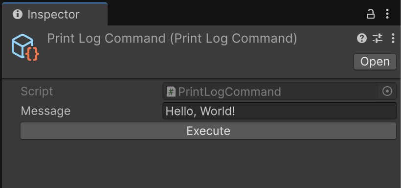
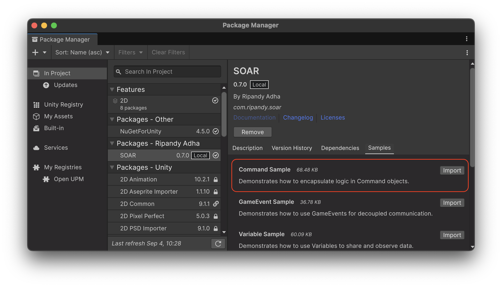

# Command

[コマンドパターン](https://gameprogrammingpatterns.com/command.html)の実装である SOAR の `Command` クラスは、アクションや操作を ScriptableObject としてカプセル化する方法を提供します。
これにより、エディタースクリプト、UI イベント、または他のゲームロジックなど、アプリケーションのさまざまな部分からトリガーできる再利用可能な操作を定義でき、疎結合なアーキテクチャを促進します。
このパターンは、ロギングなどの一方向の実行に役立ちます。

`Command` は `SoarCore` を継承し、エディター統合やドメインリロードの処理など、そのライフサイクル管理機能を利用します。

## コアコンセプト

### 同期実行

コマンドをトリガーする主な方法は、その `Execute()` メソッドを呼び出すことです。このメソッドには、コマンドが表すアクションのロジックが含まれている必要があります。

```csharp
// シンプルなコマンドの例
// File: MySimpleCommand.cs
using Soar;
using Soar.Commands;
using UnityEngine;

[CreateAssetMenu(fileName = "MySimpleCommand", menuName = MenuHelper.DefaultCommandMenu + "My Simple Command")]
public class MySimpleCommand : Command
{
    public override void Execute()
    {
        Debug.Log("MySimpleCommand Executed!");
    }
}
```

このコマンドを使用するには：

1.  `Assets/Create/SOAR/Commands/My Simple Command` メニューから `MySimpleCommand` のインスタンスを作成します。
2.  このインスタンスをスクリプトまたは UI イベントに割り当てます。
3.  `mySimpleCommandInstance.Execute()` を呼び出してコマンドを実行します。

### 非同期実行

コマンドは `ExecuteAsync()` メソッドを介した非同期実行もサポートしています。
これは、時間がかかり、メインスレッドをブロックすべきでない操作に役立ちます。

効率的な非同期操作のために `ValueTask` を返します。
キャンセルを可能にするために、オプションの `CancellationToken` を受け入れます。
提供された `CancellationToken` を `Application.exitCancellationToken` と自動的にリンクし、アプリケーションが終了した場合に非同期操作がキャンセルされるようにします。
デフォルトでは、`ExecuteAsync()` は単に同期 `Execute()` メソッドを呼び出し、完了した `ValueTask` を返します。
真の非同期動作を実装するには、派生クラスで `ExecuteAsync()` をオーバーライドします。

```csharp
// 非同期コマンドの例
// File: MyAsyncCommand.cs
using Soar;
using Soar.Commands;
using System.Threading;
using System.Threading.Tasks;
using UnityEngine;

[CreateAssetMenu(fileName = "MyAsyncCommand", menuName = MenuHelper.DefaultCommandMenu + "My Async Command")]
public class MyAsyncCommand : Command
{
    public override void Execute()
    {
        // 必要に応じて同期実行のフォールバック
        Debug.Log("MyAsyncCommand Executed (synchronously).");
    }

    public override async ValueTask ExecuteAsync(CancellationToken cancellationToken = default)
    {
        // Application.exitCancellationToken とのリンクは基本クラスによって処理されます
        Debug.Log("MyAsyncCommand Started (asynchronously)...");
        try
        {
            await Task.Delay(2000, cancellationToken); // 非同期作業をシミュレート
            Debug.Log("MyAsyncCommand Finished (asynchronously).");
        }
        catch (System.OperationCanceledException)
        {
            Debug.Log("MyAsyncCommand was cancelled.");
        }
    }
}
```

### パラメータ付きコマンド

入力パラメータを必要とするコマンドには、ジェネリック `Command<T>` クラスを使用します。

```csharp
// パラメータ付きコマンドの例
// File: LogMessageCommand.cs
using Soar;
using Soar.Commands;
using UnityEngine;

[CreateAssetMenu(fileName = "LogMessageCommand", menuName = MenuHelper.DefaultCommandMenu + "Log Message Command")]
public class LogMessageCommand : Command<string>
{
    public override void Execute(string message)
    {
        Debug.Log($"Message: {message}");
    }

    // 必要に応じて ExecuteAsync(T param, CancellationToken cancellationToken) をオーバーライド
    // パラメータ付きの特定の非同期動作が必要な場合。
    // デフォルトでは、Execute(param) を呼び出します。
}
```

これを使用するには：

```csharp
// 他のスクリプトで
public LogMessageCommand logCommand;
public string messageToLog = "Hello from Command!";

void Start()
{
    if (logCommand != null)
    {
        logCommand.Execute(messageToLog);
    }
}
```

`Command<T>` の非ジェネリック `Execute()` メソッドは `Execute(default(T))` を呼び出します。

## エディタ統合

`Command`（またはそこから派生したクラス）が Unity エディターで選択されると、インスペクターに「Execute」ボタンが表示されます。
それをクリックすると、選択した `Command` インスタンスの `Execute()` メソッドが呼び出されます。

 

!!! note "エディタ実行"
    インスペクターの「Execute」ボタンを使用すると、再生モードと編集モードの両方でコマンドを実行できます。`Execute()` メソッド内のコードが編集モードで安全に実行できることを確認してください。プロジェクトファイルやシーンの状態に永続的な影響を与える可能性があります。

## ライフサイクルと破棄

`Command` は `SoarCore` を継承しているため、SOAR のライフサイクルに参加します。コマンドがリソースをクリーンアップする必要がある場合は、`Dispose()` メソッドをオーバーライドできます。デフォルトでは、`Command` の `Dispose()` メソッドは空です。

```csharp
// File: MyResourcefulCommand.cs
using Soar;
using Soar.Commands;
using UnityEngine;

[CreateAssetMenu(fileName = "MyResourcefulCommand", menuName = MenuHelper.DefaultCommandMenu + "My Resourceful Command")]
public class MyResourcefulCommand : Command
{
    private System.IO.StreamWriter _writer;

    public override void Execute()
    {
        _writer = new System.IO.StreamWriter("my_command_log.txt", append: true);
        _writer.WriteLine($"Command executed at {System.DateTime.Now}");
        Debug.Log("MyResourcefulCommand Executed and wrote to log.");
    }

    public override void Dispose()
    {
        _writer?.Dispose();
        _writer = null;
        Debug.Log("MyResourcefulCommand Disposed.");
        base.Dispose(); // SoarCore の Dispose にロジックがある場合は base を呼び出す
    }
}
```

## ユースケース

コマンドは汎用性があり、コードの整理と再利用性を向上させるために多くのシナリオで利用できます。
以下に、コマンドを活用できるユースケースをいくつか示します：

- **`SubmitFormCommand<FormData>`**:
  フォームデータをパラメータとして受け取るコマンド。
  入力を検証し、バックエンドサービスに送信したり、ローカルのゲームデータを更新したりできます。

- **`SaveGameCommand`**:
  自動保存タイマー、プレイヤーのアクション、またはレベルの移行によって開始されたかどうかに関係なく、ゲームの保存プロセスをトリガーする一貫した方法を提供します。
  コマンド自体が保存/読み込みシステムと対話します。

- **`AnalyticsEventCommand<AnalyticsData>`**:
  分析イベントを送信するための汎用コマンド。
  ゲームのさまざまな部分が、分析 SDK の実装の詳細を知る必要なく、特定の `AnalyticsData`（レベル完了、アイテム購入など）でこのコマンドを発生させることができます。

- **エディターからの特定の機能のデバッグとテスト：**
  「エディター統合」セクションで示したように、任意の `Command` はインスペクターから直接実行できます。
  これは、ゲームシーケンス全体を再生する必要なく、分離されたロジックをテストするために非常に貴重です。

コマンドを使用することで、関心の分離が明確になります。
コマンドの呼び出し元は、アクションが*どのように*実行されるかを知る必要はなく、*どのアクション*をトリガーするかだけを知る必要があります。
これにより、コードベースがよりモジュール化され、理解しやすくなり、保守と拡張が簡単になります。

## サンプル使用法

この機能をテストするには、パッケージマネージャウィンドウから関連するサンプルパッケージをインポートできます。



このサンプルでは、パラメータなしおよび型付きの `Command` アセットを作成して、コンソールにメッセージを記録する方法を示します。
インスペクターの `UnityEvent` から直接トリガーする方法を示します。

詳細なセットアップと使用手順については、インポート後に `CommandSamples` フォルダ内の `README.md` ファイルを参照してください。
