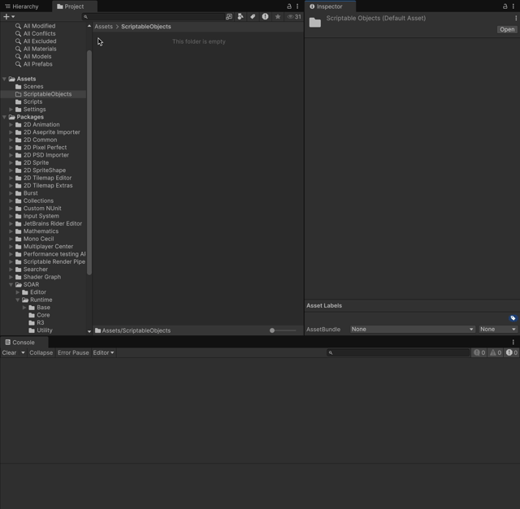
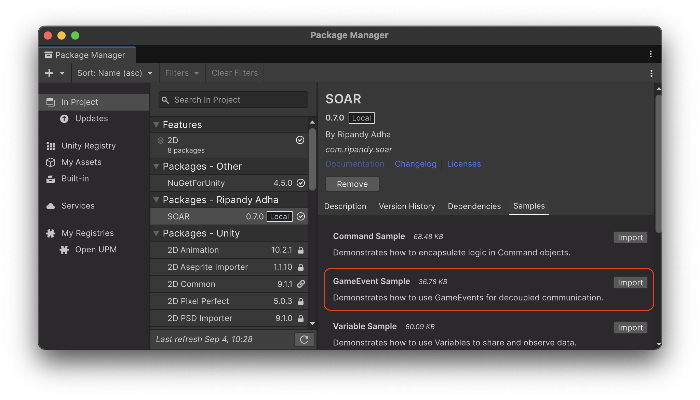

# GameEvent

`GameEvent` is a core feature in SOAR that implements the publish-subscribe pattern using `ScriptableObject` assets.
An event represents an occurrence within the program execution that requires a specific response.
This allows for decoupled communication between different parts of an application, where an event can be published (raised) by one system and listened to by multiple other systems without them needing direct references to each other.

## `GameEvent` (Parameterless)

The base `GameEvent` represents an event that does not carry any data.

### Creating a GameEvent

Create a `GameEvent` asset from the `Assets > Create > SOAR > Game Events > GameEvent` menu.



### Raising a GameEvent from a Script

To raise an event from a script, call the `Raise()` method on the `GameEvent` instance.
All active subscribers will be notified.

```csharp
// File: GameEventPublisherExample.cs
using Soar.Events;
using UnityEngine;

public class GameEventPublisherExample : MonoBehaviour
{
    [SerializeField] private GameEvent gameEvent;

    private void Update()
    {
        if (Input.GetKeyDown(KeyCode.Space))
        {
            gameEvent.Raise();
            Debug.Log($"Game Event {gameEvent.name} Raised.");
        }
    }
}
```

### Subscribing to a GameEvent from a Script

To listen for an event, call the `Subscribe()` method with an `Action` to be executed when the event is raised.
The `Subscribe` method returns an `IDisposable` which should be stored and disposed of when the listener no longer needs to receive events (e.g., in `OnDestroy` or `OnDisable`).

```csharp
// File: GameEventSubscriberExample.cs
using System;
using Soar.Events;
using UnityEngine;

public class GameEventSubscriberExample : MonoBehaviour
{
    [SerializeField] private GameEvent gameEvent;
    
    private IDisposable subscription;
    
    private void Start()
    {
        subscription = gameEvent.Subscribe(OnGameEventRaised);
    }

    private void OnGameEventRaised()
    {
        Debug.Log($"Game Event {gameEvent.name} Received.");
    }
    
    private void OnDestroy()
    {
        subscription?.Dispose();
    }
}
```

## `GameEvent<T>` (With Data)

The generic `GameEvent<T>` class allows creating events that carry a data payload of a specific type `T`.

### Creating a Typed GameEvent

SOAR provides some common typed `GameEvent`s (e.g., `IntGameEvent`, `StringGameEvent`) that can be created from the menu.
Custom typed `GameEvent`s can be created by inheriting from `GameEvent<T>`:

```csharp
// File: MyCustomDataGameEvent.cs
using System;
using Soar;
using Soar.Events;
using UnityEngine;

// Define custom data structure
[Serializable]
public struct MyCustomData
{
    public int id;
    public string message;
}

// Create a new GameEvent asset type for MyCustomData
[CreateAssetMenu(fileName = "MyCustomDataGameEvent", menuName = MenuHelper.DefaultGameEventMenu + "My Custom Data GameEvent")]
public class MyCustomDataGameEvent : GameEvent<MyCustomData> { }
```

Then, an asset of this type can be created from `Create > SOAR > Game Events > My Custom Data GameEvent`.

### Raising a Typed Event

Call `Raise(T value)` with the data payload.

```csharp
// File: MyCustomDataGameEvent.cs
using UnityEngine;

public class MyTypedPublisher : MonoBehaviour
{
    [SerializeField] private MyCustomDataGameEvent onDataPublished;

    private void Update()
    {
        if (Input.GetKeyDown(KeyCode.Space))
        {
            var data = new MyCustomData { id = 1, message = "Hello World" };
            onDataPublished.Raise(data);
        }
    }
}
```

### Subscribing to a Typed Event

Subscribe with an `Action<T>` to receive the data.

```csharp
// File: MyTypedSubscriber.cs
using System;
using UnityEngine;

public class MyTypedSubscriber : MonoBehaviour
{
    [SerializeField] private MyCustomDataGameEvent gameEvent;
    
    private IDisposable subscription;
    
    private void Start()
    {
        subscription = gameEvent.Subscribe(HandlePublishedData);
    }

    private void HandlePublishedData(MyCustomData data)
    {
        Debug.Log($"Data received: ID={data.id}, Message='{data.message}'");
    }
    
    private void OnDestroy()
    {
        subscription?.Dispose();
    }
}
```

The `GameEvent<T>` also has a `value` field that stores the last raised value. This value is reset to `default(T)` when the application quits or when domain reload is disabled and play mode is exited.

## R3 Integration

When the R3 library is present, `GameEvent`s are enhanced with powerful reactive and asynchronous capabilities.

-   **`AsObservable()`**: Returns the event as an R3 `Observable` stream.
    -   For a parameterless `GameEvent`, this returns an `Observable<Unit>`.
    -   For a `GameEvent<T>`, it returns an `Observable<T>`.
-   **`AsUnitObservable()`**: Specific to `GameEvent<T>`, this returns an `Observable<Unit>`, useful for when you only need to know *that* an event was raised, but not its value.
-   **`EventAsync()`**: Returns a `ValueTask` (or `ValueTask<T>`) that completes the next time the event is raised.
-   **`ToAsyncEnumerable()`**: Converts the event stream into an `IAsyncEnumerable<T>`, allowing it to be consumed in an `await foreach` loop.

### Examples

**Using `AsObservable` with `GameEvent<T>`:**
```csharp
using R3;
using Soar.Events;
using UnityEngine;

public class EventLogger : MonoBehaviour
{
    [SerializeField] private StringGameEvent onImportantEvent;

    void Start()
    {
        onImportantEvent.AsObservable()
            .Subscribe(message => Debug.Log($"Event received: {message}"))
            .AddTo(this);
    }
}
```

**Awaiting a GameEvent:**
```csharp
using Soar.Events;
using UnityEngine;

public class LevelManager : MonoBehaviour
{
    [SerializeField] private GameEvent onPlayerReady;

    private async void Start()
    {
        Debug.Log("Waiting for player to be ready...");
        await onPlayerReady.EventAsync();
        Debug.Log("Player is ready! Starting level.");
    }
}
```

## Editor Integration

`GameEvent` assets have a custom editor inspector.

- **Raise Button**: A "Raise" button is available in the Inspector for all `GameEvent`s. Clicking this button will call the `Raise()` method on the event, which is useful for debugging and testing event responses in both Edit Mode and Play Mode.

- **Value Display (for `GameEvent<T>`)**: For typed `GameEvent<T>`, the current `value` (or the properties of the value if it's a complex type) is displayed in the Inspector, which allows for viewing and sometimes modifying the data that will be raised if the "Raise" button is pressed without providing a new value.

## Lifecycle and Disposal

`GameEvent`s are `ScriptableObject`s and implement `IDisposable`.

- Subscriptions are managed internally. When a `GameEvent` is disposed (which happens as part of the `SoarCore` lifecycle, typically on application quit), its subscriptions are cleared.
- For the independent implementation (when `SOAR_R3` is not defined), subscriptions are stored in a list and disposed of.
- When `SOAR_R3` is defined, `GameEvent`s use R3 `Subject`s internally, and disposal is handled by disposing of the `Subject`.
- The `SoarCore` base class handles initialization and cleanup, including calling `Dispose()` during `OnQuit`. It also manages behavior related to Unity's "Enter Play Mode Options" (like Disable Domain Reload).

This ensures that resources are cleaned up correctly and event listeners do not attempt to operate on disposed objects.

## Sample Usage

To test this feature, the relevant sample package can be imported from the Package Manager window.



The **GameEvent Sample** demonstrates how a UI Button can raise a `GameEvent` to communicate with a listener component without a direct reference. The listener then updates a UI Text element in response.

For detailed setup and usage instructions, please refer to the `README.md` file inside the `GameEventSamples` folder after importing.

## Special GameEvents

### `BoolGameEvent`

The `BoolGameEvent` has a `RaiseToggled()` method that raises the event with the opposite of the current value.
