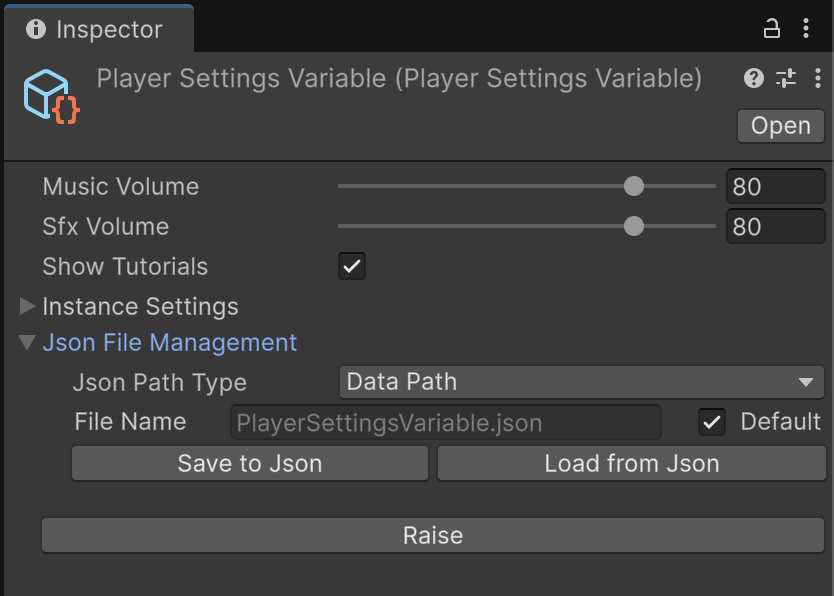
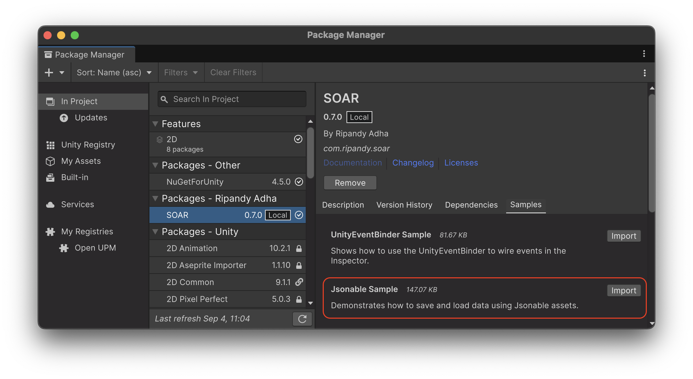

# Jsonable 拡張

SOAR には、`Variable` アセットを JSON 形式との間でシリアル化および逆シリアル化できる強力な「Jsonable 拡張」機能が含まれています。
これは、ゲームデータや初期設定の保存と読み込みに特に役立ちます。
この機能は、`JsonableVariable<T>` 基本クラスとカスタムインスペクターウィンドウを介して公開されており、変数のデータを JSON 文字列またはローカルファイルに変換するためのツールを提供します。

## コアコンセプト

### `IJsonable` インターフェース

`IJsonable` インターフェースは、JSON 文字列との間で変換できるオブジェクトの規約を定義します。これには2つのメソッドが含まれています：

-   `ToJsonString()`: オブジェクトのデータを JSON 形式の文字列に変換します。
-   `FromJsonString(string jsonString)`: JSON 形式の文字列からオブジェクトのデータを設定します。

### `JsonableVariable<T>`

`JsonableVariable<T>` は、`Variable<T>` を継承し、`IJsonable` インターフェースを実装する抽象クラスです。JSON に保存または JSON から読み込む必要がある `Variable` は、このクラスを継承する必要があります。

シリアル化する場合、`JsonableVariable<T>` はプリミティブ型（`int`、`float`、`string` など）を `JsonableWrapper<T>` でラップして、JSON オブジェクトとして正しくフォーマットされるようにします（例：`{"value": 10}`）。複雑な `[Serializable]` 型は直接シリアル化されます。

## `JsonableVariable` の作成

カスタム `Variable` を jsonable にするには、`Variable<T>` の代わりに `JsonableVariable<T>` を継承するだけです。

1.  **データ型の定義**: データ型が `[Serializable]` であることを確認します。

    ```csharp
    // File: PlayerSettings.cs
    using System;

    [Serializable]
    public struct PlayerSettings
    {
        public float musicVolume;
        public float sfxVolume;
        public bool showTutorials;
    }
    ```

2.  **JsonableVariable クラスの作成**: `JsonableVariable<T>` を継承します。

    ```csharp
    // File: PlayerSettingsVariable.cs
    using Soar;
    using Soar.Variables;
    using UnityEngine;

    [CreateAssetMenu(fileName = "PlayerSettingsVariable", menuName = MenuHelper.DefaultVariableMenu + "Player Settings Variable")]
    public class PlayerSettingsVariable : JsonableVariable<PlayerSettings> { }
    ```

これで、`PlayerSettingsVariable` アセットを作成でき、インスペクターで JSON シリアル化機能が利用可能になります。

## エディタ統合

`JsonableVariableEditor` は、`JsonableVariable<T>` を継承するアセットにカスタムインスペクターを提供します。標準の `Variable` 機能に加えて、「Json File Management」セクションが含まれています。



この UI では、次のことが可能です：

-   **保存パスの選択**: Unity の `Application.dataPath`、`Application.persistentDataPath`、またはカスタムファイルパスから選択します。
-   **ファイル名の指定**: JSON ファイルのファイル名を設定できます。デフォルトでは、`ScriptableObject` アセットの名前が使用されます（例：`PlayerSettingsVariable.json`）。
-   **JSON に保存**: 「Save to Json」ボタンは、変数の現在の `Value` をシリアル化し、指定されたファイルに書き込みます。
-   **JSON から読み込み**: 「Load from Json」ボタンは、指定された JSON ファイルを読み取り、その内容を変数の `Value` に逆シリアル化します。

## `JsonableExtensions`

SOAR は、`Soar.JsonableExtensions` クラスに一連の拡張メソッドも提供しており、コードから `IJsonable` オブジェクトをより便利に操作できるようにします。

これらのメソッドを使用すると、さまざまなパスとファイル名の構成で `IJsonable` オブジェクトを保存および読み込みできます。

### ファイルへの保存

`IJsonable` オブジェクトは、コードから直接 JSON ファイルに保存できます。

```csharp
// File: SaveManager.cs
using Soar;
using Soar.Variables;
using UnityEngine;

public class SaveManager : MonoBehaviour
{
    [SerializeField] private PlayerSettingsVariable playerSettings;

    public void SaveSettings()
    {
        // "PlayerSettings.json" というファイル名で Application.persistentDataPath に保存
        playerSettings.SaveToJson(Application.persistentDataPath, "PlayerSettings");
        Debug.Log("Player settings saved!");
    }
}
```

### ファイルからの読み込み

同様に、JSON ファイルから `IJsonable` オブジェクトにデータを読み込むことができます。

```csharp
// File: LoadManager.cs
using Soar;
using Soar.Variables;
using UnityEngine;

public class LoadManager : MonoBehaviour
{
    [SerializeField] private PlayerSettingsVariable playerSettings;

    void Start()
    {
        // Application.persistentDataPath から読み込み
        if (playerSettings.IsJsonFileExist(Application.persistentDataPath, "PlayerSettings"))
        {
            playerSettings.LoadFromJson(Application.persistentDataPath, "PlayerSettings");
            Debug.Log("Player settings loaded!");
        }
        else
        {
            Debug.Log("No saved settings found. Using default values.");
        }
    }
}
```

`JsonableExtensions` クラスには、JSON ファイルの存在を確認するメソッド（`IsJsonFileExist`）も含まれており、SOAR 変数を使用したデータ永続化を管理するための完全なツールキットを提供します。

## サンプル使用法

この機能をテストするには、パッケージマネージャウィンドウから関連するサンプルパッケージをインポートできます。



The **Jsonable サンプル**は、設定データを保持するためのカスタム `JsonableVariable` を作成する方法を示します。実行時にデータを編集するための UI と、`JsonableExtensions` を使用して変数をファイルに保存および復元するボタンが含まれています。

詳細なセットアップと使用手順については、インポート後に `JsonableSamples` フォルダ内の `README.md` ファイルを参照してください。
