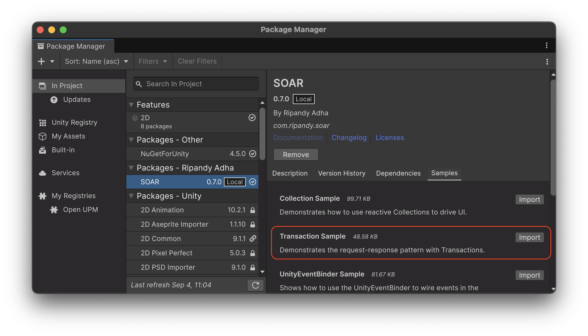

# Transaction

`Transaction` は、`ScriptableObject` アセットを使用してリクエスト/レスポンス通信パターンを容易にする双方向イベントです。
リクエストが送信されると、登録されたレスポンスハンドラがそれを処理し、リクエスタに結果を返します。
これは、サービスからのデータ取得やユーザーアクションの検証など、確認や結果が必要な操作に最適です。
一度に登録できるレスポンスハンドラは1つだけです。

## コアコンセプト

`Transaction` のワークフローには、**リクエスト**、**レスポンス**、およびオプションの**サブスクリプション**の3つの主要部分が含まれます。

- **リクエスト**: システムはリクエストを行うことでトランザクションを開始します。
これには、オプションで入力データとレスポンスのコールバックを含めることができます。
現在レスポンダが登録されていない場合、リクエストは利用可能になるまでキューに入れられます。
- **レスポンス**: リクエストを処理し、同期または非同期の結果を生成するロジック。
一度に登録できるレスポンダは1つだけで、新しいレスポンダを登録すると前のレスポンダが置き換えられます。
レスポンダが登録されると、キューに入れられたすべてのリクエストを順番に直ちに処理します。
- **サブスクリプション**: オブザーバーは、トランザクションに直接参加することなく、リアクティブなロジックをトリガーするためにリクエストまたはレスポンスをサブスクライブできます。

このパターンにより、リクエスタとレスポンダが疎結合になります。
通信するには、`Transaction` アセットへの共有参照のみが必要です。

## `Transaction` (パラメータなし)

基本の `Transaction` クラスは、データ交換を伴わないインタラクションを管理します。
これは、リクエスタがアクションが完了したことを知る必要がある単純なシグナリングに役立ちます。

### パラメータなしのトランザクションの作成

基本の `Transaction` のインスタンスは、`Assets > Create > SOAR > Transactions > Transaction` メニューから直接作成できます。

より具体的で、名前空間または名前付きのトランザクションが必要な場合は、基本の `Transaction` クラスを継承してカスタムクラスを作成できます：

```csharp
// File: MySimpleTransaction.cs
using Soar;
using Soar.Transactions;
using UnityEngine;

[CreateAssetMenu(fileName = "MySimpleTransaction", menuName = MenuHelper.DefaultTransactionMenu + "My Simple Transaction")]
public class MySimpleTransaction : Transaction {}
```

### レスポンスの登録

トランザクションは、リクエストを処理するために登録されたレスポンスを必要とします。
レスポンスは、トランザクションのクラス定義内で内部的に、または別のスクリプトから外部的に登録できます。

- **内部登録**: `RegisterResponseInternal()` メソッドをトランザクションを継承するクラスでオーバーライドして、そのデフォルトの動作を定義できます。
このレスポンスは、アセットが初期化されるときに自動的に登録されます。

```csharp
// File: MyInternallyHandledTransaction.cs
using Soar;
using Soar.Transactions;
using UnityEngine;

[CreateAssetMenu(fileName = "MyInternallyHandledTransaction", menuName = MenuHelper.DefaultTransactionMenu + "My Internally Handled Transaction")]
public class MyInternallyHandledTransaction : Transaction
{
    protected override void RegisterResponseInternal()
    {
        RegisterResponse(() => Debug.Log("Internal response executed!"));
    }
}
```

- **外部登録**: `RegisterResponse()` メソッドを任意のスクリプトから呼び出して、実行時にトランザクションの動作を設定またはオーバーライドできます。
これは、レスポンスロジックが変更される可能性のある動的なシナリオに役立ちます。
同期（`Action`）および非同期（`Func<ValueTask>`）の両方のレスポンスがサポートされています。

```csharp
// File: TransactionResponder.cs
using Soar.Transactions;
using UnityEngine;
using System.Threading.Tasks;

public class TransactionResponder : MonoBehaviour
{
    [SerializeField] private Transaction myTransaction;

    private void Start()
    {
        // 同期レスポンスを登録
        myTransaction.RegisterResponse(HandleSyncResponse);

        // または、非同期レスポンスを登録
        // myTransaction.RegisterResponse(HandleAsyncResponse);
    }

    private void OnDestroy()
    {
        myTransaction.UnregisterResponse();
    }

    private void HandleSyncResponse()
    {
        Debug.Log("External synchronous response executed!");
    }

    private async ValueTask HandleAsyncResponse()
    {
        Debug.Log("Async response started...");
        await Task.Delay(1000); // 作業をシミュレート
        Debug.Log("Async response finished.");
    }
}
```

### リクエスト

トランザクションは、コールバックベースのリクエストの場合は `Request(Action onResponse)` を呼び出すことによってリクエストされます。リクエストが行われると、登録されたレスポンスロジックが呼び出されます。

```csharp
// File: TransactionUserExample.cs
using Soar.Transactions;
using UnityEngine;

public class TransactionUserExample : MonoBehaviour
{
    [SerializeField] private Transaction myTransaction;

    private void Start()
    {
        myTransaction.Request(() => Debug.Log("Transaction completed!"));
    }
}
```

非同期リクエストの場合は、待機可能な `ValueTask` を返す `RequestAsync()` を使用します。

```csharp
// File: AsyncTransactionUserExample.cs
using Soar.Transactions;
using UnityEngine;

public class AsyncTransactionUserExample : MonoBehaviour
{
    [SerializeField] private Transaction myTransaction;

    private async void Start()
    {
        await myTransaction.RequestAsync();
        Debug.Log("Async transaction completed!");
    }
}
```

## `Transaction<TRequest, TResponse>` (型付き)

ジェネリック `Transaction<TRequest, TResponse>` クラスを使用すると、入力値と出力値を持つトランザクションが可能になります。

### `Transaction<T>` (対称型)

便宜上、SOAR は `Transaction<T, T>` の短縮形である `Transaction<T>` 基本クラスを提供します。
これは、リクエストとレスポンスのデータが同じ型を共有するシナリオ（値を受け取り、変更して返す操作など）に役立ちます。

```csharp
// File: ModifyNumberTransaction.cs
using Soar;
using Soar.Transactions;
using UnityEngine;

[CreateAssetMenu(fileName = "ModifyNumberTransaction", menuName = MenuHelper.DefaultTransactionMenu + "Modify Number Transaction")]
public class ModifyNumberTransaction : Transaction<int> // Transaction<int, int> から継承
{
    protected override void RegisterResponseInternal()
    {
        RegisterResponse(request => request * 2);
    }
}
```

### 型付きトランザクションの作成

`Transaction<TRequest, TResponse>` を継承し、レスポンスロジックを実装することで、カスタムトランザクションを作成できます。

```csharp
// File: IntToStringTransaction.cs
using Soar;
using Soar.Transactions;
using UnityEngine;

[CreateAssetMenu(fileName = "IntToStringTransaction", menuName = MenuHelper.DefaultTransactionMenu + "Int To String Transaction")]
public class IntToStringTransaction : Transaction<int, string>
{
    protected override void RegisterResponseInternal()
    {
        RegisterResponse(request => $"Value is {request}");
    }
}
```

### 値付きリクエスト

型付きトランザクションは、コールバックベースのリクエストの場合は `Request(TRequest, Action<TResponse>)` を呼び出すことによってリクエストされます。

```csharp
// File: TypedTransactionUserExample.cs
using Soar.Transactions;
using UnityEngine;

public class TypedTransactionUserExample : MonoBehaviour
{
    [SerializeField] private IntToStringTransaction intToStringTransaction;

    private void Start()
    {
        intToStringTransaction.Request(42, response => Debug.Log(response));
    }
}
```

非同期リクエストの場合は、待機可能な `ValueTask<TResponse>` を返す `RequestAsync(TRequest)` を使用します。

```csharp
// File: AsyncTypedTransactionUserExample.cs
using Soar.Transactions;
using UnityEngine;

public class AsyncTypedTransactionUserExample : MonoBehaviour
{
    [SerializeField] private IntToStringTransaction intToStringTransaction;

    private async void Start()
    {
        var result = await intToStringTransaction.RequestAsync(99);
        Debug.Log($"Async result: {result}");
    }
}
```

## リクエストとレスポンスのサブスクライブ

トランザクションは、リクエストまたはレスポンスが発生したときに監視するためのサブスクリプションメソッドを提供します。不要になったサブスクリプションは破棄する必要があります。

```csharp
// File: TransactionMonitor.cs
using System;
using Soar.Transactions;
using UnityEngine;

public class TransactionMonitor : MonoBehaviour
{
    [SerializeField] private Transaction transaction;

    private IDisposable requestSubscription;
    private IDisposable responseSubscription;

    private void Start()
    {
        requestSubscription = transaction.SubscribeToRequest(() => Debug.Log("Request made"));
        responseSubscription = transaction.SubscribeToResponse(() => Debug.Log("Response made"));
    }

    private void OnDestroy()
    {
        requestSubscription?.Dispose();
        responseSubscription?.Dispose();
    }
}
```

型付きトランザクションの場合：

```csharp
// File: TypedTransactionMonitor.cs
using System;
using Soar.Transactions;
using UnityEngine;

public class TypedTransactionMonitor : MonoBehaviour
{
    [SerializeField] private IntToStringTransaction transaction;
    
    private IDisposable requestSubscription;
    private IDisposable responseSubscription;

    private void Start()
    {
        requestSubscription = transaction.SubscribeToRequest(request => Debug.Log($"Requested: {request}"));
        responseSubscription = transaction.SubscribeToResponse(response => Debug.Log($"Responded: {response}"));
    }

    private void OnDestroy()
    {
        requestSubscription?.Dispose();
        responseSubscription?.Dispose();
    }
}
```

## R3 との連携

R3 ライブラリが存在する場合、`Transaction` は非同期リクエスト/レスポンスサイクルを処理し、同時実行性を管理するための堅牢なツールで強化されます。

-   **`AsRequestObservable()` / `AsResponseObservable()`**: これらのメソッドは、リクエストが行われたとき、またはレスポンスが返されたときにリアクティブにリッスンできる `Observable` ストリームを返します。
-   **`RequestAsync()`**: これは非同期リクエストを行うための主要なメソッドです。登録されたレスポンスハンドラが作業を完了すると完了する `ValueTask`（または `ValueTask<TResponse>`）を返します。
-   **非同期 `RegisterResponse`**: 最も強力な機能は、`async` メソッドをレスポンスハンドラとして登録する機能です。`Func<ValueTask>`、`Func<TRequest, ValueTask<TResponse>>`、およびその他の非同期デリゲートを使用できます。

### `AwaitOperation` による同時実行性

非同期レスポンスを登録するときに、`AwaitOperation` を指定して、レスポンスがまだ処理中に複数のリクエストが到着した場合に `Transaction` がどのように動作するかを制御できます。

-   **`Parallel`**: (デフォルト) すべての着信リクエストを同時に処理します。
-   **`Sequential`**: 着信リクエストをキューに入れ、一度に1つずつ処理します。
-   **`Drop`**: リクエストがすでに進行中の場合、新しいリクエストは無視されます。
-   **`Switch`**: 新しいリクエストが到着した場合、前の未完了のリクエストはキャンセルされます。
-   **`ThrottleFirst`**: リクエストをスロットリングし、特定の時間枠で最初のもののみを許可します。

### 例

```csharp
// File: MyAsyncService.cs
using Soar.Transactions;
using System.Threading.Tasks;
using UnityEngine;

public class MyAsyncService : MonoBehaviour
{
    [SerializeField] private StringTransaction fetchDataTransaction;

    void Start()
    {
        // ウェブリクエストをシミュレートする非同期レスポンスハンドラを登録
        fetchDataTransaction.RegisterResponse(async (request) =>
        {
            Debug.Log($"Fetching data for: {request}...");
            await Task.Delay(1000); // ネットワーク遅延をシミュレート
            return $"Data for {request}";
        }, R3.AwaitOperation.Sequential); // リクエストを1つずつ処理
    }
}
```

## エディタ統合

トランザクションには、Unity エディターにカスタムインスペクターがあります。

- **リクエストボタン**: すべての `Transaction` アセットのインスペクターで「Request」ボタンが利用できます。このボタンをクリックするとリクエストがトリガーされ、テストやデバッグに役立ちます。

- **ダミーレスポンスハンドラ**: トランザクションにレスポンスハンドラが登録されていない場合にリクエストが行われると、ダミーのレスポンスハンドラが一時的に登録されます。これにより、エディターで行われたリクエストが適切に応答されるようになります。


- **値の表示**: 型付きトランザクションの場合、現在のリクエストとレスポンスの値がインスペクターに表示されます。

- **値リクエストボタン**: 型付きトランザクションの場合、インスペクターに表示されている現在のリクエスト値でリクエストすることもできます。


## ライフサイクルと破棄

トランザクションは `ScriptableObject` であり、`IDisposable` を実装しています。

- **初期化**: 有効になると、トランザクションは内部レスポンスハンドラ（もしあれば）を登録し、保留中のリクエストをクリアします。
- **破棄**: アプリケーションの終了時またはドメインリロード時（有効な場合）、トランザクションはサブスクリプションを破棄し、メモリリークを防ぐためにリクエストをクリアします。
- **リセット**: `ResetResponseInternal()` メソッドを呼び出して、登録されたレスポンスをデフォルトの実装にリセットできます。

## ユースケース

トランザクションは、次のような疎結合なリクエスト/レスポンスフローを必要とするシナリオに適しています：

- **サービスコール**: 非同期レスポンスを持つバックエンドまたはサービスリクエストのカプセル化。
- **ゲームロジック**: 確認コールバック付きの購入、保存、読み込みなどの操作の処理。
- **エディタツール**: デバッグまたは自動化のために Unity エディターから操作をトリガーおよび監視。

トランザクションを使用することで、システムはモジュール式でテスト可能でリアクティブな方法で通信でき、同期および非同期の両方のワークフローをサポートします。

## サンプル使用法

この機能をテストするには、パッケージマネージャウィンドウから関連するサンプルパッケージをインポートできます。



The **Transaction サンプル**は、完全なリクエスト/レスポンス/サブスクライブのライフサイクルを示します。長時間実行されるプロセスをシミュレートするリクエスタ、リクエストを処理するレスポンダ、およびリクエストとレスポンスが発生したときにログを記録するオブザーバーコンポーネントが含まれています。

詳細なセットアップと使用手順については、インポート後に `TransactionSamples` フォルダ内の `README.md` ファイルを参照してください。
