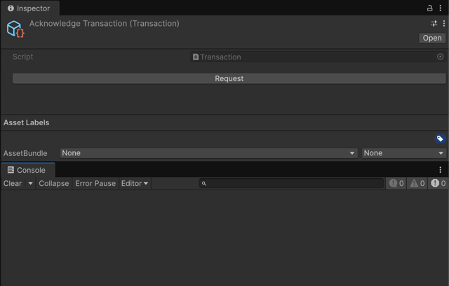
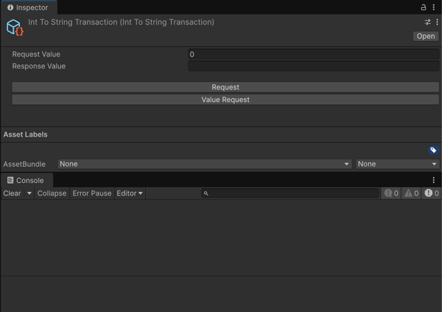
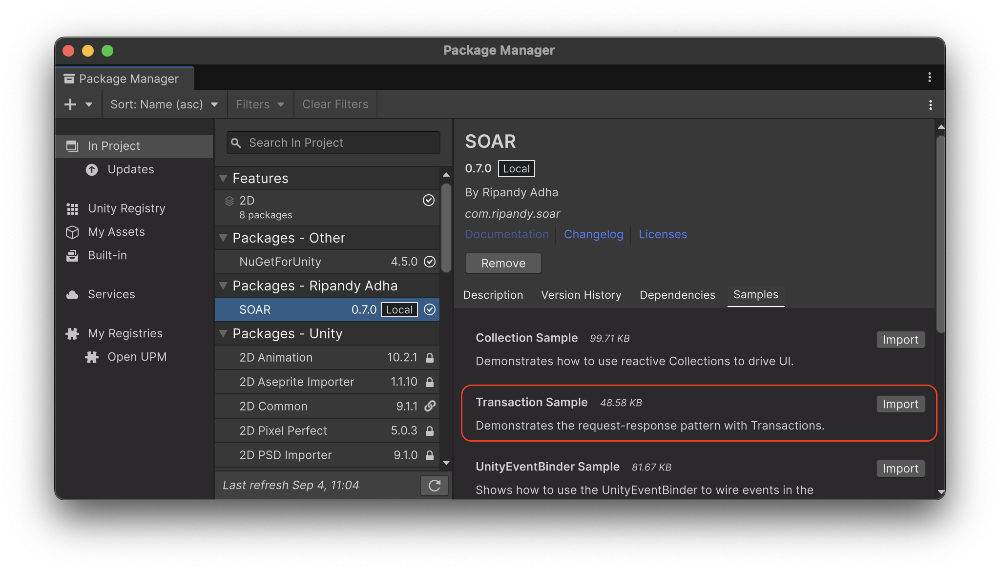

# Transaction

A `Transaction` is a two-way event that facilitates a request-response communication pattern using `ScriptableObject` assets.
When a request is sent, a registered response handler processes it and returns a result to the requester.
This is ideal for operations that require confirmation or a result, such as fetching data from a service or validating a user action.
Only one response handler can be registered at a time.

## Core Concepts

A `Transaction`'s workflow involves three main parts: a **Request**, a **Response**, and optional **Subscriptions**.

- **Request**: A system initiates a transaction by making a request.
This can optionally include input data and a callback for the response.
If no responder is currently registered, requests are queued until one becomes available.
- **Response**: The logic that handles a request and produces a result, which can be synchronous or asynchronous.
Only one responder can be registered at a time; registering a new one replaces the previous.
When a responder is registered, it immediately processes all queued requests in order.
- **Subscription**: Observers can subscribe to requests or responses to trigger reactive logic without participating directly in the transaction.

This pattern ensures that the requester and responder are decoupled.
They only need a shared reference to the `Transaction` asset to communicate.

## `Transaction` (Parameterless)

The base `Transaction` class manages interactions that do not involve data exchange.
It's useful for simple signaling where the requester needs to know that an action has been completed.

### Creating a Parameterless Transaction

An instance of the base `Transaction` can be created directly from the `Assets > Create > SOAR > Transactions > Transaction` menu.

If a more specific, namespace or named transaction is preferred, a custom class can be created by inheriting from the base `Transaction` class:

```csharp
// File: MySimpleTransaction.cs
using Soar;
using Soar.Transactions;
using UnityEngine;

[CreateAssetMenu(fileName = "MySimpleTransaction", menuName = MenuHelper.DefaultTransactionMenu + "My Simple Transaction")]
public class MySimpleTransaction : Transaction {}
```

### Registering Response

A Transaction needs a registered response to process requests.
A response can be registered in two ways: internally within the Transaction's class definition, or externally from another script.

- **Internal Registration**: The `RegisterResponseInternal()` method can be overridden in a class inheriting from Transaction to define its default behavior.
This response is automatically registered when the asset is initialized.

```csharp
// File: MyInternallyHandledTransaction.cs
using Soar;
using Soar.Transactions;
using UnityEngine;

[CreateAssetMenu(fileName = "MyInternallyHandledTransaction", menuName = MenuHelper.DefaultTransactionMenu + "My Internally Handled Transaction")]
public class MyInternallyHandledTransaction : Transaction
{
    protected override void RegisterResponseInternal()
    {
        RegisterResponse(() => Debug.Log("Internal response executed!"));
    }
}
```

- **External Registration**: The `RegisterResponse()` method can be called from any script to set or override the transaction's behavior at runtime.
This is useful for dynamic scenarios where the response logic might change.
Both synchronous (`Action`) and asynchronous (`Func<ValueTask>`) responses are supported.

```csharp
// File: TransactionResponder.cs
using Soar.Transactions;
using UnityEngine;
using System.Threading.Tasks;

public class TransactionResponder : MonoBehaviour
{
    [SerializeField] private Transaction myTransaction;

    private void Start()
    {
        // Register a synchronous response
        myTransaction.RegisterResponse(HandleSyncResponse);

        // Or, register an asynchronous response
        // myTransaction.RegisterResponse(HandleAsyncResponse);
    }

    private void OnDestroy()
    {
        myTransaction.UnregisterResponse();
    }

    private void HandleSyncResponse()
    {
        Debug.Log("External synchronous response executed!");
    }

    private async ValueTask HandleAsyncResponse()
    {
        Debug.Log("Async response started...");
        await Task.Delay(1000); // Simulate work
        Debug.Log("Async response finished.");
    }
}
```

### Requesting

A transaction is requested by calling `Request(Action onResponse)` for callback-based requests. The registered response logic is invoked when a request is made.

```csharp
// File: TransactionUserExample.cs
using Soar.Transactions;
using UnityEngine;

public class TransactionUserExample : MonoBehaviour
{
    [SerializeField] private Transaction myTransaction;

    private void Start()
    {
        myTransaction.Request(() => Debug.Log("Transaction completed!"));
    }
}
```

For asynchronous requests, use `RequestAsync()` which returns a `ValueTask` that can be awaited.

```csharp
// File: AsyncTransactionUserExample.cs
using Soar.Transactions;
using UnityEngine;

public class AsyncTransactionUserExample : MonoBehaviour
{
    [SerializeField] private Transaction myTransaction;

    private async void Start()
    {
        await myTransaction.RequestAsync();
        Debug.Log("Async transaction completed!");
    }
}
```

## `Transaction<TRequest, TResponse>` (Typed)

The generic `Transaction<TRequest, TResponse>` class allows for transactions with input and output values.

### `Transaction<T>` (Symmetric Typed)

For convenience, SOAR provides the `Transaction<T>` base class, which is a shorthand for `Transaction<T, T>`.
This is useful for scenarios where the request and response data share the same type, such as an operation that takes a value, modifies it, and returns it.

```csharp
// File: ModifyNumberTransaction.cs
using Soar;
using Soar.Transactions;
using UnityEngine;

[CreateAssetMenu(fileName = "ModifyNumberTransaction", menuName = MenuHelper.DefaultTransactionMenu + "Modify Number Transaction")]
public class ModifyNumberTransaction : Transaction<int> // Inherits from Transaction<int, int>
{
    protected override void RegisterResponseInternal()
    {
        RegisterResponse(request => request * 2);
    }
}
```

### Creating a Typed Transaction

A custom transaction can be created by inheriting from `Transaction<TRequest, TResponse>` and implementing the response logic.

```csharp
// File: IntToStringTransaction.cs
using Soar;
using Soar.Transactions;
using UnityEngine;

[CreateAssetMenu(fileName = "IntToStringTransaction", menuName = MenuHelper.DefaultTransactionMenu + "Int To String Transaction")]
public class IntToStringTransaction : Transaction<int, string>
{
    protected override void RegisterResponseInternal()
    {
        RegisterResponse(request => $"Value is {request}");
    }
}
```

### Requesting with Values

A typed transaction is requested by calling `Request(TRequest, Action<TResponse>)` for callback-based requests.

```csharp
// File: TypedTransactionUserExample.cs
using Soar.Transactions;
using UnityEngine;

public class TypedTransactionUserExample : MonoBehaviour
{
    [SerializeField] private IntToStringTransaction intToStringTransaction;

    private void Start()
    {
        intToStringTransaction.Request(42, response => Debug.Log(response));
    }
}
```

For asynchronous requests, use `RequestAsync(TRequest)`, which returns a `ValueTask<TResponse>` that can be awaited.

```csharp
// File: AsyncTypedTransactionUserExample.cs
using Soar.Transactions;
using UnityEngine;

public class AsyncTypedTransactionUserExample : MonoBehaviour
{
    [SerializeField] private IntToStringTransaction intToStringTransaction;

    private async void Start()
    {
        var result = await intToStringTransaction.RequestAsync(99);
        Debug.Log($"Async result: {result}");
    }
}
```

## Subscribing to Requests and Responses

Transactions provide subscription methods to observe when requests or responses occur. Subscriptions should be disposed of when no longer needed.

```csharp
// File: TransactionMonitor.cs
using System;
using Soar.Transactions;
using UnityEngine;

public class TransactionMonitor : MonoBehaviour
{
    [SerializeField] private Transaction transaction;

    private IDisposable requestSubscription;
    private IDisposable responseSubscription;

    private void Start()
    {
        requestSubscription = transaction.SubscribeToRequest(() => Debug.Log("Request made"));
        responseSubscription = transaction.SubscribeToResponse(() => Debug.Log("Response made"));
    }

    private void OnDestroy()
    {
        requestSubscription?.Dispose();
        responseSubscription?.Dispose();
    }
}
```

For typed transactions:

```csharp
// File: TypedTransactionMonitor.cs
using System;
using Soar.Transactions;
using UnityEngine;

public class TypedTransactionMonitor : MonoBehaviour
{
    [SerializeField] private IntToStringTransaction transaction;
    
    private IDisposable requestSubscription;
    private IDisposable responseSubscription;

    private void Start()
    {
        requestSubscription = transaction.SubscribeToRequest(request => Debug.Log($"Requested: {request}"));
        responseSubscription = transaction.SubscribeToResponse(response => Debug.Log($"Responded: {response}"));
    }

    private void OnDestroy()
    {
        requestSubscription?.Dispose();
        responseSubscription?.Dispose();
    }
}
```

## R3 Integration

When the R3 library is present, `Transaction`s are supercharged with robust tools for handling asynchronous request-response cycles and managing concurrency.

-   **`AsRequestObservable()` / `AsResponseObservable()`**: These methods return `Observable` streams that allow you to reactively listen for when requests are made or when responses are returned.
-   **`RequestAsync()`**: This is the primary method for making asynchronous requests. It returns a `ValueTask` (or `ValueTask<TResponse>`) that completes when the registered response handler finishes its work.
-   **Asynchronous `RegisterResponse`**: The most powerful feature is the ability to register `async` methods as response handlers. You can use `Func<ValueTask>`, `Func<TRequest, ValueTask<TResponse>>`, and other async delegates.

### Concurrency with `AwaitOperation`

When registering an asynchronous response, you can specify an `AwaitOperation` to control how the `Transaction` behaves if multiple requests arrive while a response is still being processed.

-   **`Parallel`**: (Default) Processes all incoming requests concurrently.
-   **`Sequential`**: Queues incoming requests and processes them one at a time.
-   **`Drop`**: If a request is already in progress, new requests are ignored.
-   **`Switch`**: If a new request arrives, the previous, unfinished request is cancelled.
-   **`ThrottleFirst`**: Throttles requests, allowing only the first one in a given time window.

### Example

```csharp
// File: MyAsyncService.cs
using Soar.Transactions;
using System.Threading.Tasks;
using UnityEngine;

public class MyAsyncService : MonoBehaviour
{
    [SerializeField] private StringTransaction fetchDataTransaction;

    void Start()
    {
        // Register an async response handler that simulates a web request
        fetchDataTransaction.RegisterResponse(async (request) =>
        {
            Debug.Log($"Fetching data for: {request}...");
            await Task.Delay(1000); // Simulate network latency
            return $"Data for {request}";
        }, R3.AwaitOperation.Sequential); // Process requests one by one
    }
}
```

## Editor Integration

Transactions have custom inspectors in the Unity Editor.

- **Request Button**: A "Request" button is available in the Inspector for all `Transaction` assets. Clicking this button will trigger a request, useful for testing and debugging.

- **Dummy Response Handler**: Upon requests, when there are no response handler registered in the Transaction, a dummy response handler will temporarily registered. This ensures that requests made on the editor be responded properly.



- **Value Display**: For typed transactions, the current request and response values are displayed in the Inspector.

- **Value Request Button**: For typed transactions, you can also request with current request value displayed in the inspector.



## Lifecycle and Disposal

Transactions are `ScriptableObject`s and implement `IDisposable`.

- **Initialization**: On enable, transactions register their internal response handler (if any), and clear pending requests.
- **Disposal**: On application quit or domain reload (when enabled), transactions dispose of subscriptions and clear requests to prevent memory leaks.
- **Reset**: The `ResetResponseInternal()` method can be called to reset the registered response to its default implementation.

## Use Cases

Transactions are suitable for scenarios requiring decoupled request-response flows, such as:

- **Service Calls**: Encapsulating backend or service requests with asynchronous responses.
- **Game Logic**: Handling operations like purchasing, saving, or loading with confirmation callbacks.
- **Editor Tools**: Triggering and observing operations from the Unity Editor for debugging or automation.

By using transactions, systems can communicate in a modular, testable, and reactive manner, supporting both synchronous and asynchronous workflows.

## Sample Usage

To test this feature, the relevant sample package can be imported from the Package Manager window.



The **Transaction Sample** demonstrates the full request-response-subscribe lifecycle. It includes a requester that simulates a long-running process, a responder that handles the request, and observer components that log when the request and response occur.

For detailed setup and usage instructions, please refer to the `README.md` file inside the `TransactionSamples` folder after importing.
