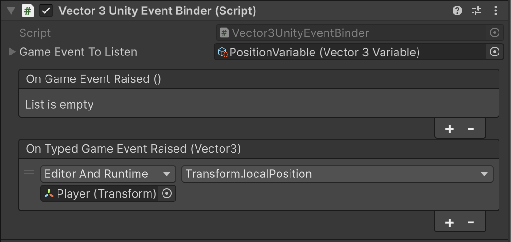
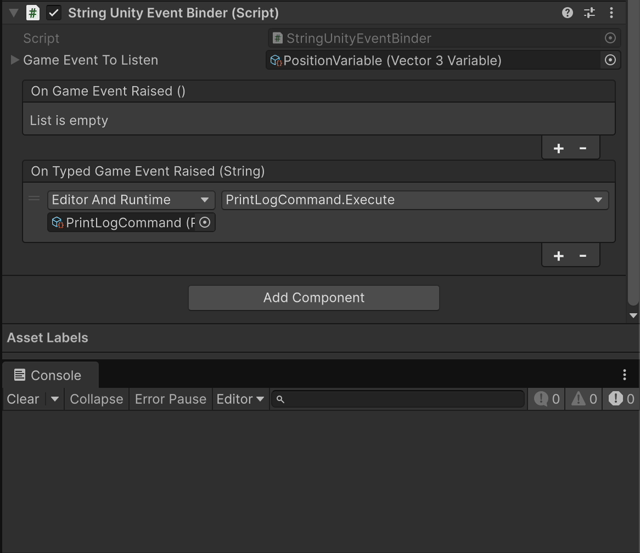
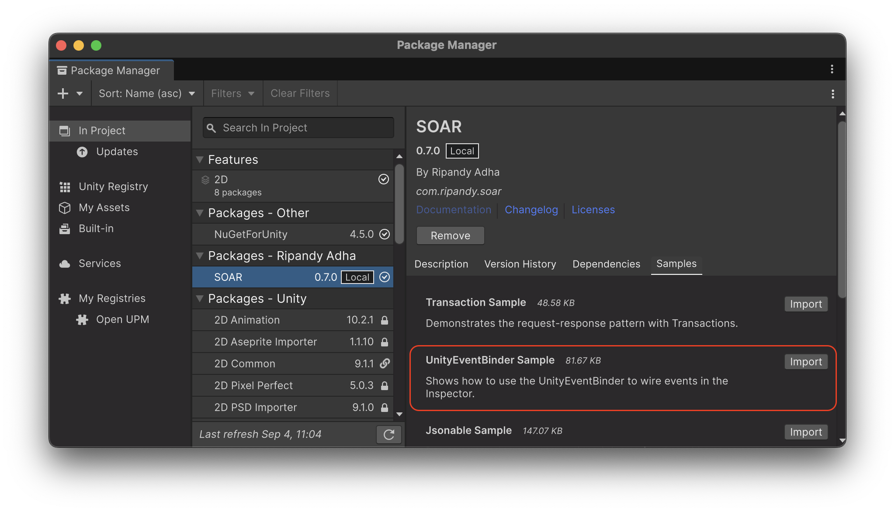

# Unity Event Binder

`UnityEventBinder` は、SOAR の `GameEvent` と Unity の組み込み `UnityEvent` システムとの間のギャップを埋める重要な `MonoBehaviour` コンポーネントです。
「イベントリスナー」とも呼ばれ、`GameEvent` アセットをリッスンし、それに応じて `UnityEvent` を呼び出すことで、コードなしでインスペクターで直接ゲームロジックを接続できます。

## コアコンセプト

`UnityEventBinder` は、シーン内の `GameObject` にアタッチされる `MonoBehaviour` です。主な目的は2つあります：

1.  **`GameEvent` をリッスンする**: 特定の `GameEvent` アセットがバインダーに割り当てられます。
2.  **`UnityEvent` をトリガーする**: 指定された `GameEvent` が発生すると、バインダーはインスペクターで設定できる `UnityEvent` を呼び出します。

これにより、強力で疎結合なワークフローが作成されます。`GameEvent` を発生させるオブジェクトは、それに反応するオブジェクトについて何も知る必要がなく、その逆も同様です。

## `UnityEventBinder` (パラメータなしの GameEvents 用)

非ジェネリックの `UnityEventBinder` は、データを運ばない `GameEvent` に使用されます。

### 使用方法

1.  **コンポーネントの追加**: シーン内の `GameObject` を選択し、`UnityEventBinder` コンポーネントを追加します（`Add Component > SOAR > Unity Event Binder`）。

2.  **GameEvent の割り当て**: インスペクターで、パラメータなしの `GameEvent` アセットを `Game Event To Listen` フィールドにドラッグアンドドロップします。

    

3.  **UnityEvent の設定**: `On Game Event Raised` `UnityEvent` を設定します。`GameObject` またはコンポーネントをイベントスロットにドラッグし、イベントが発生したときに呼び出されるパブリックメソッドを選択できます。

    

これで、割り当てられた `GameEvent` が（スクリプト、別の `UnityEvent`、またはインスペクターから）発生するたびに、`UnityEventBinder` は設定されたメソッドを呼び出します。

## `UnityEventBinder<T>` (データ付きの GameEvents 用)

ジェネリックの `UnityEventBinder<T>` は、データペイロードを運ぶ `GameEvent<T>` に使用されます。SOAR は、一般的な型用に事前ビルドされたバインダーのセットを提供します。

### 事前ビルドされたバインダー

さまざまな型用の事前ビルドされたバインダーは、`Add Component > SOAR > Unity Event Binders` にあります：

-   `BoolUnityEventBinder`
-   `ByteUnityEventBinder`
-   `DoubleUnityEventBinder`
-   `FloatUnityEventBinder`
-   `IntUnityEventBinder`
-   `LongUnityEventBinder`
-   `StringUnityEventBinder`
-   `PoseUnityEventBinder`
-   `QuaternionUnityEventBinder`
-   `Vector2UnityEventBinder`
-   `Vector3UnityEventBinder`

### 型付きバインダーの使用方法

プロセスはパラメータなしのバインダーと似ていますが、型付きの `UnityEvent` を使用します：

1.  **型付きバインダーの追加**: 特定の型付きバインダーを `GameObject` に追加します（例：`Vector3UnityEventBinder`）。

2.  **型付き GameEvent の割り当て**: 対応する型付き `GameEvent<T>` アセットを割り当てます（例：`Vector3Variable`。`Variable<T>` は `GameEvent<T>` から派生しているため）。

3.  **型付き UnityEvent の設定**: インスペクターには `On Typed Game Event Raised (T)` イベント（例：`On Typed Game Event Raised (Vector3)`）が表示されます。これは、イベントのデータペイロードをリスニングメソッドに直接渡すことができる `UnityEvent<T>` です。対応する型のパラメータを受け入れるメソッドを選択できます。

    たとえば、Transform の `localPosition` は、`Vector3UnityEventBinder` の `UnityEvent` に直接リンクできます。

    

### 特別なバインダー

-   **`BoolUnityEventBinder`**: 標準の `UnityEvent<bool>` に加えて、このバインダーは、反対のブール値で呼び出される `On Negated Bool Event Raised` イベントも提供します。

    

-   **`StringUnityEventBinder`**: このバインダーには特別な動作があり、パラメータなしの `GameEvent` でも使用できます。この場合、`GameEvent` オブジェクト自体の `ToString()` 表現で `UnityEvent<string>` を呼び出します。

    

-   **`UnityEventBatchBinder`**: このコンポーネントを使用すると、複数の `GameEvent` をリッスンし、それに応じて単一の `UnityEvent` を呼び出すことができます。これは、複数のイベントが同じ応答をトリガーする必要がある場合に便利です。

## カスタム `UnityEventBinder<T>` の作成

必要に応じて、カスタムの型付き `UnityEventBinder` を作成できます：

1.  **カスタムデータ型と `GameEvent<T>` の定義**: `[Serializable]` データ型と、それに対応する `GameEvent<T>` クラスを定義する必要があります。

    ```csharp
    // File: PlayerData.cs
    using System;

    [Serializable]
    public struct PlayerData
    {
        public string name;
        public int level;
    }

    // File: PlayerDataGameEvent.cs
    using Soar.Events;
    using UnityEngine;

    [CreateAssetMenu(fileName = "PlayerDataGameEvent", menuName = "SOAR/Game Events/Player Data GameEvent")]
    public class PlayerDataGameEvent : GameEvent<PlayerData> { }
    ```

2.  **カスタムバインダークラスの作成**: カスタム型を指定して `UnityEventBinder<T>` を継承する新しいクラスを作成します。

    ```csharp
    // File: PlayerDataUnityEventBinder.cs
    using Soar.Events;

    public class PlayerDataUnityEventBinder : UnityEventBinder<PlayerData> { }
    ```

`UnityEventBinder<T>` 基本クラスがすべてのロジックを処理します。`PlayerDataUnityEventBinder` コンポーネントを `GameObject` に追加して、`PlayerDataGameEvent` をリッスンするために使用できるようになりました。

## ライフサイクル

`UnityEventBinder` は、`Start()` メソッドで `GameEvent` へのサブスクライブを自動的に処理し、`OnDestroy()` メソッドでサブスクライブを解除します。これにより、`GameObject` が破棄されたときに残っているサブスクリプションによるメモリリークがないことが保証されます。

## サンプル使用法

この機能をテストするには、パッケージマネージャウィンドウから関連するサンプルパッケージをインポートできます。



The **UnityEventBinder サンプル**は、`UnityEventBinder` が `GameEvent` をリッスンし、それに応じて `UnityEvent` をトリガーする方法を示します。これはすべてインスペクターで設定されます。これにより、イベントをコンポーネントメソッドにコードなしで接続できます。

詳細なセットアップと使用手順については、インポート後に `UnityEventBinderSamples` フォルダ内の `README.md` ファイルを参照してください。
