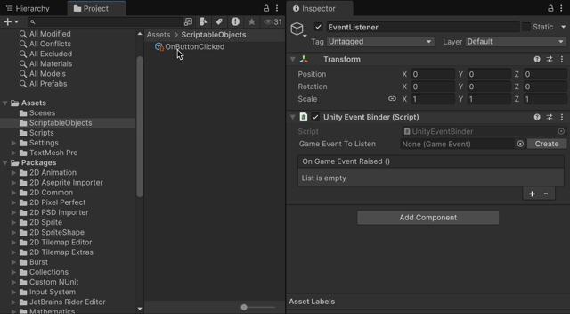
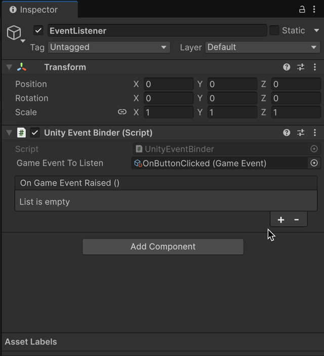
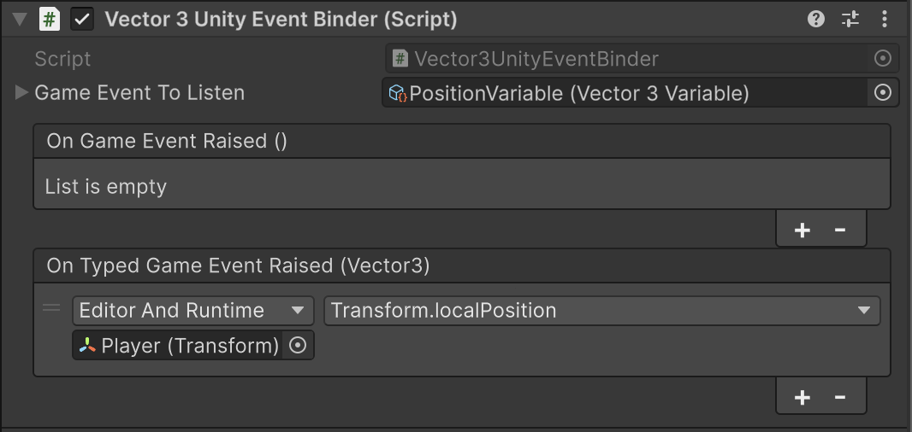
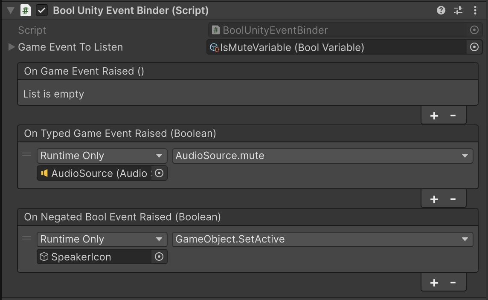
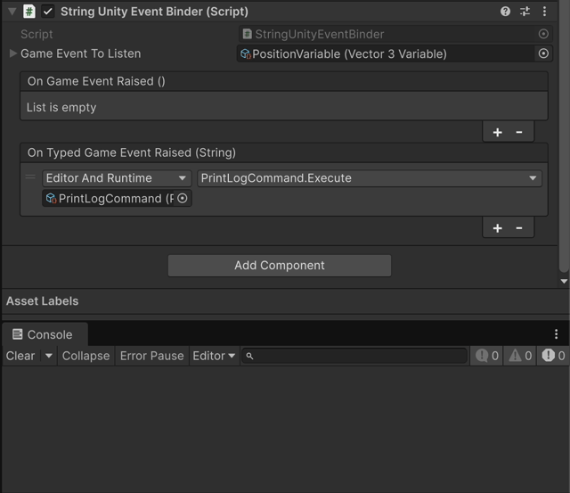
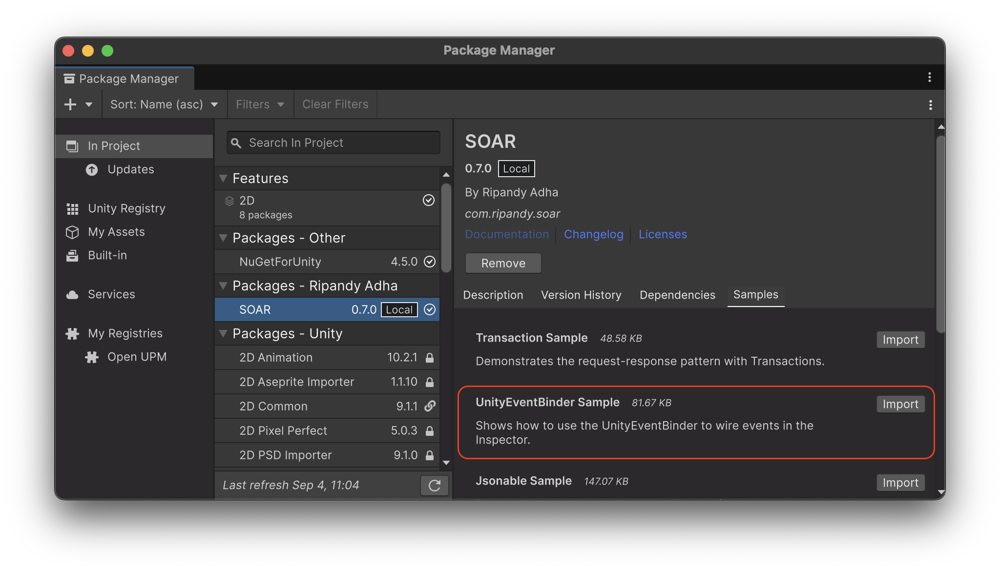

# Unity Event Binder

The `UnityEventBinder` is a crucial `MonoBehaviour` component that bridges the gap between SOAR's `GameEvent`s and Unity's built-in `UnityEvent` system.
Often called an "Event Listener," it listens for a `GameEvent` asset and, in response, invokes a `UnityEvent`, allowing for game logic to be wired up directly in the Inspector without code.

## Core Concept

The `UnityEventBinder` is a `MonoBehaviour` that is attached to a `GameObject` in a scene. It has two main purposes:

1.  **Listen to a `GameEvent`**: A specific `GameEvent` asset is assigned to the binder.
2.  **Trigger a `UnityEvent`**: When the specified `GameEvent` is raised, the binder invokes a `UnityEvent` that can be configured in the Inspector.

This creates a powerful and decoupled workflow. The object raising the `GameEvent` doesn't need to know anything about the objects that will react to it, and vice-versa.

## `UnityEventBinder` (for parameterless GameEvents)

The non-generic `UnityEventBinder` is used for `GameEvent`s that do not carry any data.

### How to Use

1.  **Add the Component**: A `GameObject` in a scene is selected and the `UnityEventBinder` component is added to it (`Add Component > SOAR > Unity Event Binder`).

2.  **Assign the GameEvent**: In the Inspector, a parameterless `GameEvent` asset is dragged and dropped into the `Game Event To Listen` field.

    

3.  **Configure the UnityEvent**: The `On Game Event Raised` `UnityEvent` is configured. `GameObject`s or components can be dragged into the event slot and a public method can be selected to be called when the event is raised.

    

Now, whenever the assigned `GameEvent` is raised (from a script, another `UnityEvent`, or the Inspector), the `UnityEventBinder` will invoke the configured methods.

## `UnityEventBinder<T>` (for GameEvents with data)

The generic `UnityEventBinder<T>` is used for `GameEvent<T>`s that carry a data payload. SOAR provides a set of pre-built binders for common types.

### Pre-built Binders

Pre-built binders for various types can be found under `Add Component > SOAR > Unity Event Binders`:

-   `BoolUnityEventBinder`
-   `ByteUnityEventBinder`
-   `DoubleUnityEventBinder`
-   `FloatUnityEventBinder`
-   `IntUnityEventBinder`
-   `LongUnityEventBinder`
-   `StringUnityEventBinder`
-   `PoseUnityEventBinder`
-   `QuaternionUnityEventBinder`
-   `Vector2UnityEventBinder`
-   `Vector3UnityEventBinder`

### How to Use Typed Binders

The process is similar to the parameterless binder, but with a typed `UnityEvent`:

1.  **Add a Typed Binder**: A specific typed binder is added to a `GameObject` (e.g., `Vector3UnityEventBinder`).

2.  **Assign the Typed GameEvent**: A corresponding typed `GameEvent<T>` asset is assigned (e.g., a `Vector3Variable`, as `Variable<T>` derived from `GameEvent<T>`).

3.  **Configure the Typed UnityEvent**: The Inspector will show a `On Typed Game Event Raised (T)` event (e.g., `On Typed Game Event Raised (Vector3)`). This is a `UnityEvent<T>` that can pass the event's data payload directly to the listening methods. Methods that accept a parameter of the corresponding type can be selected.

    For example, a Transform's `localPosition` can be linked directly to a `Vector3UnityEventBinder`'s `UnityEvent`.

    

### Special Binders

-   **`BoolUnityEventBinder`**: In addition to the standard `UnityEvent<bool>`, this binder also provides an `On Negated Bool Event Raised` event that is invoked with the opposite boolean value.

    

-   **`StringUnityEventBinder`**: This binder has a special behavior where it can also be used with a parameterless `GameEvent`. In this case, it will invoke the `UnityEvent<string>` with the `ToString()` representation of the `GameEvent` object itself.

    

-   **`UnityEventBatchBinder`**: This component allows you to listen to multiple `GameEvent`s and invoke a single `UnityEvent` in response. This is useful when you have multiple events that should trigger the same response.

## Creating Custom `UnityEventBinder<T>`

A custom typed `UnityEventBinder` can be created as necessary:

1.  **Define the Custom Data Type and `GameEvent<T>`**: A `[Serializable]` data type and a corresponding `GameEvent<T>` class for it must be defined.

    ```csharp
    // File: PlayerData.cs
    using System;

    [Serializable]
    public struct PlayerData
    {
        public string name;
        public int level;
    }

    // File: PlayerDataGameEvent.cs
    using Soar.Events;
    using UnityEngine;

    [CreateAssetMenu(fileName = "PlayerDataGameEvent", menuName = "SOAR/Game Events/Player Data GameEvent")]
    public class PlayerDataGameEvent : GameEvent<PlayerData> { }
    ```

2.  **Create the Custom Binder Class**: A new class that inherits from `UnityEventBinder<T>` is created, specifying the custom type.

    ```csharp
    // File: PlayerDataUnityEventBinder.cs
    using Soar.Events;

    public class PlayerDataUnityEventBinder : UnityEventBinder<PlayerData> { }
    ```

The `UnityEventBinder<T>` base class handles all the logic. The `PlayerDataUnityEventBinder` component can now be added to a `GameObject` and used to listen for `PlayerDataGameEvent`s.

## Lifecycle

The `UnityEventBinder` automatically handles subscribing to the `GameEvent` in its `Start()` method and unsubscribing in its `OnDestroy()` method. This ensures that there are no memory leaks from lingering subscriptions when the `GameObject` is destroyed.

## Sample Usage

To test this feature, the relevant sample package can be imported from the Package Manager window.



The **UnityEventBinder Sample** demonstrates how a `UnityEventBinder` can listen for a `GameEvent` and trigger a `UnityEvent` in response, all configured in the Inspector. This allows for codeless wiring of events to component methods.

For detailed setup and usage instructions, please refer to the `README.md` file inside the `UnityEventBinderSamples` folder after importing.
