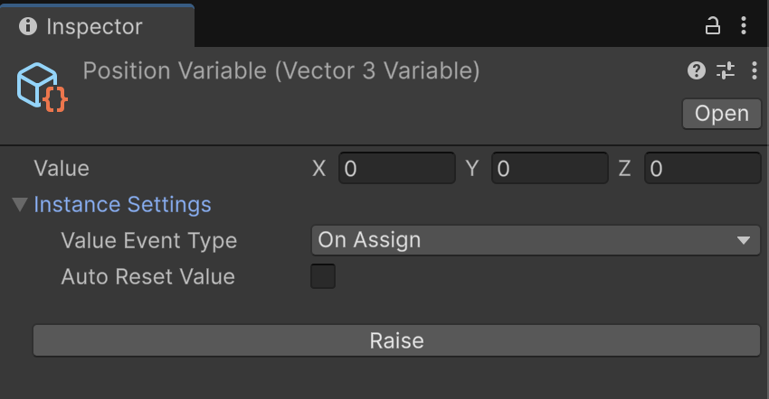
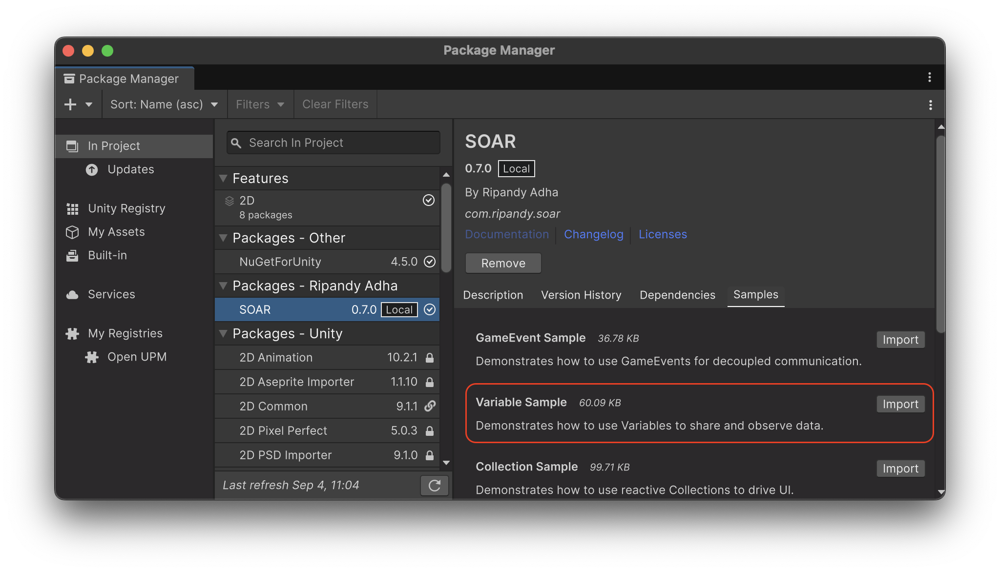

# Variable

SOAR の `Variable<T>` クラスは、`ScriptableObject` に保存されるデータコンテナを表します。
これは `GameEvent<T>` システムを拡張しており、`Variable<T>` の `Value` が変更されるたびにイベントを発行し、すべてのサブスクライバーに新しい値を通知します。
これにより、`Variable<T>` は、アプリケーション全体で簡単に共有および監視できるリアクティブなデータを作成するための強力なツールになります。

`Variable<T>` は、Raise および Subscribe イベント機能を備えた `GameEvent<T>` から継承し、したがってライフサイクル管理機能を持つ `SoarCore` からも継承します。

## `Variable<T>`

ジェネリック `Variable<T>` クラスは、すべての変数型の基礎です。型 `T` の値を保持し、この値にアクセス、変更、および監視するメカニズムを提供します。



- **Value プロパティ**: `Variable<T>` と対話する主な方法は、その `Value` プロパティを介することです。`Value` プロパティに新しい値を割り当てると、`Raise(T)` メソッドがトリガーされ、サブスクライバーに通知されます。

- **Value Event Type**: （インスペクターで設定可能な）`valueEventType` フィールドは、値変更イベントがいつ発生するかを決定します：
  
    - `OnAssign`: 新しい値が古い値と同じであっても、`Value` プロパティが設定されるたびにイベントが発生します。
    - `OnChange`: 新しい値が現在の値と異なる場合にのみイベントが発生します。
    これは `IsValueEquals(T)` メソッドによってチェックされます。

- **変更のサブスクライブ**: `Variable<T>` は `GameEvent<T>` から継承しているため、同じ `Subscribe` メソッドを使用して値の変更をサブスクライブできます：
  
    - `Subscribe(Action<T> action)`: 新しい値を受け取ります。
    - `Subscribe(Action<T, T> action)`: 古い値と新しい値の両方を受け取ります。これは `Variable<T>` に固有です。
    - `Subscribe(Action<PairwiseValue<T>> action)`: 古い値と新しい値の両方を含む `PairwiseValue<T>` 構造体を受け取ります。これも `Variable<T>` に固有です。

- **初期値とリセット**:
  
    - `InitialValue` プロパティは、初期化時（ゲームの開始時やエディターのコンパイル時など）の変数の値を保存します。
    - `ResetValue()` メソッドを使用すると、変数の `Value` を `InitialValue` に戻すことができます。

- **Auto Reset Value**: （インスペクターで設定可能な）`autoResetValue` ブールフィールドは、再生モードの終了時に `Variable<T>` が自動的に `ResetValue()` を呼び出すかどうかを決定します。これは、テスト後に変数を既知の状態に戻すのに役立ちます。

!!! Note "シリアル化とディープコピー"
    `autoResetValue` が複雑なクラス型で機能するために、SOAR は初期値を JSON 文字列にシリアル化して「ディープコピー」を実行します。これには2つの重要な意味があります：
    1.  **パフォーマンス:** このシリアル化は、特に起動時にガベージと CPU オーバーヘッドを発生させる可能性があります。パフォーマンスが重要な変数の場合は、値でコピーされ、このプロセスを回避する構造体またはプリミティブ型を使用することをお勧めします。
    2.  **互換性:** このメソッドは、すべての型、特に `Transform` や `GameObject` などの Unity エンジン型では機能しません。これらの型をリセットする必要がある場合は、手動で処理する必要があります。

### 変数の作成

SOAR は、一般的な Unity および C# 型（例：`IntVariable`、`FloatVariable`、`StringVariable`、`Vector3Variable`）用に、いくつかの事前定義された `Variable` 型を提供します。これらは `Assets > Create > SOAR > Variables` メニューから作成できます。

!!! Note "アセンブリ定義参照"
    これらの一般的な型は、SOAR のコアクラス `Soar.asmdef` アセンブリ定義ファイルとは異なる `Soar.Base.asmdef` アセンブリ定義ファイル内で定義されています。`Soar.Base.asmdef` 参照がそれを必要とする asmdef に追加されていることを確認してください。

カスタムデータ型の変数を作成するには：

1.  カスタムデータ構造を定義します。インスペクターでデータを表示および変更できるようにするには、`[Serializable]` として設定する必要があります。
    
    ```csharp
    // File: MyCustomData.cs
    using System;

    [Serializable]
    public struct MyCustomData
    {
        public int score;
        public string playerName;
    }
    ```

2.  カスタム型を指定して `Variable<T>` を継承する新しいクラスを作成します。

    ```csharp
    // File: MyCustomDataVariable.cs
    using Soar;
    using Soar.Variables;
    using UnityEngine;

    [CreateAssetMenu(fileName = "MyCustomDataVariable", menuName = MenuHelper.DefaultVariableMenu + "My Custom Data Variable")]
    public class MyCustomDataVariable : Variable<MyCustomData> { }
    ```

3.  `MyCustomDataVariable` のインスタンスは、`Assets > Create > SOAR > Variables > My Custom Data Variable` メニューから作成できるようになります。

### 値へのアクセスと変更

変数の値は `Value` ゲッター（プロパティ）からアクセスできます。同じプロパティを使用して、変数の値を `Value` セッター（プロパティ）から設定できます。値を変更すると、値変更イベントが発生します。

```csharp
// File: VariableUserExample.cs
using Soar.Variables;
using UnityEngine;

public class VariableUserExample : MonoBehaviour
{
    [SerializeField] private IntVariable scoreVariable;

    void Start()
    {
        Debug.Log($"Initial Score: {scoreVariable.Value}");
    }

    public void AddScore(int amount)
    {
        scoreVariable.Value += amount;
    }
}
```

### 値の変更のサブスクライブ

`Variable<T>` の変更は、それにサブスクリプションを確立することで監視できます。このメカニズムは、`GameEvent<T>` へのサブスクライブに似ています。`Variable<T>` の `Value` が変更されると、サブスクライブされたすべてのアクションが呼び出されます。メモリリークや意図しない動作を防ぐために、サブスクリプションは不要になったときに破棄する必要があります。通常は `OnDisable` または `OnDestroy` 内で行います。

```csharp
// File: ScoreDisplay.cs
using System;
using Soar.Variables;
using UnityEngine;
using UnityEngine.UI;

public class ScoreDisplay : MonoBehaviour
{
    [SerializeField] private IntVariable scoreVariable;
    [SerializeField] private Text scoreText;
    private IDisposable scoreSubscription;

    private void Start()
    {
        // 新しい値を受け取るためにサブスクライブ
        scoreSubscription = scoreVariable.Subscribe(UpdateScoreText);

        // オプションで、古い値と新しい値を受け取るためにサブスクライブ
        // scoreSubscription = scoreVariable.Subscribe(HandleScoreChangeDetailed);

        UpdateScoreText(scoreVariable.Value); // 初期値でテキストを更新
    }

    private void OnDestroy()
    {
        scoreSubscription?.Dispose();
    }

    private void UpdateScoreText(int newScore)
    {
        if (scoreText != null)
        {
            scoreText.text = $"Score: {newScore}";
        }
    }

    // 古い/新しい値のサブスクリプションの例
    private void HandleScoreChangeDetailed(int oldValue, int newValue)
    {
        Debug.Log($"Score changed from {oldValue} to {newValue}");
        UpdateScoreText(newValue);
    }
}
```

## `JsonableVariable<T>`

JSON にシリアル化または逆シリアル化する必要がある変数のために、SOAR は `JsonableVariable<T>` 基本クラスを提供します。このクラスは `IJsonable` インターフェイスを実装します。

- **`ToJsonString()`**: 変数の現在の `Value` を JSON 文字列に変換します。

  - プリミティブ型は、堅牢なシリアル化のために `JsonableWrapper<T>` でラップされます（例：`{"value": 10}`）。
  - 複雑な型は直接シリアル化されます。
  - Unity エディターでは、`JsonUtility.ToJson` を使用し、整形印刷が有効になっています。

- **`FromJsonString(string jsonString)`**: JSON 文字列を解析し、変数の `Value` を更新します。

  - プリミティブ型と複雑な型の両方のラップ解除を処理します。

カスタムの jsonable 変数は、通常の変数と同様に作成できますが、`JsonableVariable<T>` から継承します：

```csharp
// File: MyJsonableDataVariable.cs
using Soar.Variables;
using UnityEngine;

// MyCustomData が [Serializable] であると仮定
[CreateAssetMenu(fileName = "MyJsonableDataVariable", menuName = "SOAR/Jsonable Variables/My Jsonable Data Variable")]
public class MyJsonableDataVariable : JsonableVariable<MyCustomData> { }
```

[`Soar.JsonableExtensions`](Runtime/Utility/JsonableExtensions.cs) クラスは、`IJsonable` オブジェクトをファイルに簡単に保存/読み込みするための `SaveToJson` や `LoadFromJson` などのヘルパーメソッドを提供します。

## エディタ統合

`Variable<T>` および `JsonableVariable<T>` アセットには、使いやすさを向上させるためのカスタムエディタインスペクタがあります。

### `Variable<T>` インスペクタ (`VariableEditor`)

- **値の表示**: 変数の現在の `Value` が表示されます。`T` が複雑なシリアル化可能な型の場合、そのフィールドが表示されます。
- **Raise ボタン**: `GameEventEditor` から継承されたこのボタンは、変数の `Raise(Value)` を呼び出し、リスナーのテストに役立ちます。
- **インスタンス設定**:
  - `Value Event Type`: `ValueAssign` または `ValueChanged` を選択するためのドロップダウン。
  - `Auto Reset Value`: 再生モード終了時の自動値リセットを有効/無効にするためのチェックボックス。

### `JsonableVariable<T>` インスペクタ (`JsonableVariableEditor`)

`Variable<T>` インスペクタのすべての機能を継承し、以下を追加します：

- **Json ファイル管理**: 変数のデータを JSON ファイルに保存および読み込みするための折りたたみセクション。
  - **Json Path Type**: `Application.dataPath`、`Application.persistentDataPath`、またはカスタムパスから選択します。
  - **File Name**: JSON ファイル名を指定します。デフォルトで `[VariableName].json` にすることができます。
  - **Save to Json ボタン**: 現在の変数の `Value` を指定された JSON ファイルに保存します。
  - **Load from Json ボタン**: 指定された JSON ファイルから `Value` を変数に読み込みます。

## ライフサイクルと破棄

`GameEvent<T>` および `SoarCore` から派生しているため、`Variable<T>` インスタンスは：

- `ScriptableObject` であり、`IDisposable` を実装しています。
- エディターの再生モードの状態変更やドメインリロードの処理を含む、SOAR の初期化およびクリーンアップライフサイクルに参加します。
- `GameEvent<T>`（したがって `Variable<T>`）の `value` フィールドは、アプリケーションが終了するとき、またはドメインリロードが無効にされて再生モードが終了したときに `default(T)` にリセットされます（`GameEvent<T>.ResetInternal()` の一部として）。`Variable<T>` の `autoResetValue` 機能は、`InitialValue` が復元されるかどうかを制御します。

## サンプル使用法

この機能をテストするには、パッケージマネージャウィンドウから関連するサンプルパッケージをインポートできます。



The **Variable サンプル**は、キャラクターの体力を表す共有の `FloatVariable` アセットの変更に複数のコンポーネントがどのように反応するかを示します。これには、体力を減少させ、回復させ、アップグレードするコンポーネントが含まれており、すべてが互いに直接認識することなく同じデータアセットと対話します。

詳細なセットアップと使用手順については、インポート後に `VariableSamples` フォルダ内の `README.md` ファイルを参照してください。

##特別な変数

### `CameraVariable`

`CameraVariable` には `fallbackType` フィールドがあり、値が null の場合に `Camera.main` または `Camera.current` にフォールバックできます。これは、常に有効なカメラ参照があることを確認するのに役立ちます。

### `BoolVariable`

`BoolVariable` には `ToggleValue()` メソッドがあり、値を現在の値の反対に設定します。

## 値オブジェクト

### `PairwiseValue<T>`

変数の古い値と新しい値の両方を保持する構造体。これは `Variable<T>` の `Subscribe` メソッドで使用されます。
