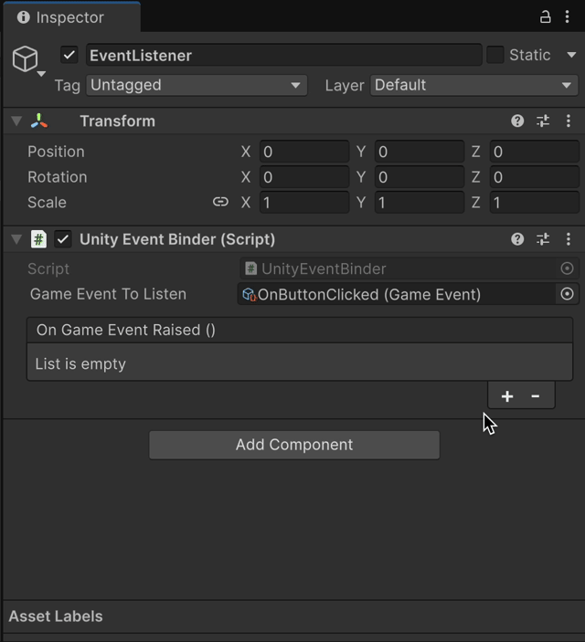

# Quick Start

## Creating SOAR's ScriptableObject Instance

SOAR's instances can be created from `Create` context menu or from `Assets/Create` on the menu bar.
Right-click on the Project window and select instance to create.

### Create a `GameEvent` Instance

For `GameEvent` instances, select any of event types from `Create/SOAR/Game Events/` menu.


### Raise GameEvent from UnityEvents

To raise an event from Unity UI's Button, assign created GameEvent instance to the Button's OnClick event.
Every time the button is clicked, the event will be published and all subscribers will be notified.


### Usage of UnityEventBinder

Unity Event Binder is a custom implemented Unity Component that forwards events raised by a `GameEvent` into `UnityEvent`.
This is also known as an `EventListener` in Scriptable Object Architecture terminology.

To use them, add the component to any GameObject and assign the GameEvent instance to the `GameEventToListen` field.


Upon raising the event, the assigned UnityEvent will be invoked.

{ width="500" }

### Raise GameEvent from Script

To raise an event from script, use the `GameEvent` instance's `Raise()` method.
Upon raising the event, all subscribers will be notified.

```csharp
using Soar.Events;
using UnityEngine;

public class GameEventPublisherExample : MonoBehaviour
{
    [SerializeField] private GameEvent gameEvent;

    private void Update()
    {
        if (Input.GetKeyDown(KeyCode.Space))
        {
            gameEvent.Raise();
            Debug.Log($"Game Event {gameEvent.name} Raised.");
        }
    }
}
```

### Subscribe to GameEvent from Script

To subscribe to an event from script, use the `GameEvent` instance's `Subscribe()` method.
Upon subscribing, the provided callback will be invoked when the event is raised.

```csharp
using System;
using Soar.Events;
using UnityEngine;

public class GameEventSubscriberExample : MonoBehaviour
{
    [SerializeField] private GameEvent gameEvent;
    
    private IDisposable subscription;
    
    private void Start()
    {
        subscription = gameEvent.Subscribe(OnGameEventRaised);
    }

    private void OnGameEventRaised()
    {
        Debug.Log($"Game Event {gameEvent.name} Received.");
    }
    
    private void OnDestroy()
    {
        subscription?.Dispose();
    }
}
```
