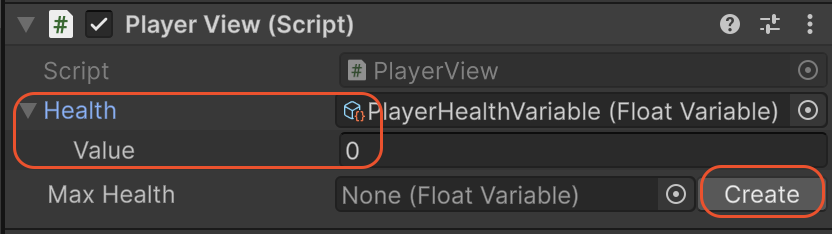

# ユーティリティとエディタツール

SOAR には、コアなアーキテクチャ機能に加えて、ワークフローを改善し、定型コードを削減し、デバッグを容易にするために設計されたユーティリティとカスタムエディタ拡張機能のコレクションが含まれています。

---

## エディタツール

SOAR のエディタスクリプトは、Unity インスペクター内で直接、大幅な生活の質の向上を提供します。

### インスペクター内のアクションボタン

ほとんどの SOAR アセットには、デバッグとテストのためのアクションボタンを備えたカスタムインスペクターがあります。

*   **`GameEvent`:** インスペクターから直接イベントをトリガーするための「Raise」ボタンが提供されます。これは、ゲームを実行したりテストコードを書いたりすることなく、`UnityEventBinder` の設定や他のリスナーをテストするのに非常に貴重です。
*   **`Command`:** 「Execute」ボタンを使用すると、コマンドのロジックをいつでも実行できます。
*   **`Transaction`:** 「Request」ボタンはトランザクションをトリガーします。レスポンスハンドラが登録されていない場合、リクエストがエラーなしで完了できるように、一時的な空のハンドラが作成されます。型付きトランザクションの場合、リクエストはインスペクターで現在入力されている値で送信できます。

これらのボタンにより、編集モードと再生モードの両方で、分離されたロジックを迅速にテストできます。

### Json ファイル管理

`JsonableVariable<T>` を継承する変数は、インスペクターに「Json File Management」セクションが表示されます。このツールは、データ永続化をコードなしで管理する方法を提供します。

*   **Json に保存:** 変数の現在の値がシリアル化され、指定されたファイルパスに保存されます。
*   **Json から読み込み:** 変数の値が、指定された JSON ファイルのデータで上書きされます。
*   **パスとファイル名:** 保存場所（`Application.dataPath`、`persistentDataPath`、またはカスタムパス）とファイル名は、インスペクターで直接設定できます。

### 拡張スクリプタブルオブジェクトドロワー

アセット間をクリックする必要性を減らすために、SOAR アセットを参照するフィールド（例：`MonoBehaviour` の `GameEvent` フィールド）は、そのアセットのプロパティを自動的にインラインで描画します。



この機能により、変数を使用するコンポーネントから離れることなく、変数の値やコレクションの内容を簡単に表示および変更できます。

さらに、アセットフィールドが空（`null`）の場合、「作成」ボタンが表示され、新しいアセットインスタンスをその場で作成および保存できます。

---

## ランタイムユーティリティ

これらのヘルパークラスは、ランタイムスクリプトで使用できます。

### `MenuHelper`

この静的クラスには、SOAR の組み込みアセットで使用されるデフォルトのメニューパスが含まれています（例：`MenuHelper.DefaultVariableMenu` は `"SOAR/Variables/"` に解決されます）。

カスタムアセットを作成する場合、このクラスを `[CreateAssetMenu]` 属性で使用して、カスタムアセットがデフォルトのものと同じ整理されたサブメニューに表示されるようにする必要があります。

```csharp
[CreateAssetMenu(fileName = "NewPlayerDataVariable", 
                 menuName = MenuHelper.DefaultVariableMenu + "Player Data")]
public class PlayerDataVariable : Variable<PlayerData> { }
```

### `JsonableExtensions`

`IJsonable` オブジェクト（`JsonableVariable<T>` など）の場合、このクラスはインスペクターツールのプログラムによる対応物を提供します。

*   `SaveToJson(path, filename)`: オブジェクトのデータをファイルに保存します。
*   `LoadFromJson(path, filename)`: ファイルからオブジェクトのデータを読み込みます。
*   `IsJsonFileExist(path, filename)`: 保存されたファイルがすでに存在するかどうかを確認します。

これらの拡張メソッドは、専用の `SaveManager` または `LoadManager` システムを作成するのに役立ちます。

### `CompositeDisposable`

このユーティリティクラスは、`IDisposable` オブジェクトのコレクションを管理します。SOAR の非 R3 実装によって内部的に使用され、すべてのアクティブなサブスクリプションを追跡します。`CompositeDisposable` が破棄されると、それが保持するすべてのサブスクリプションも破棄されます。単一の `MonoBehaviour` で複数のサブスクリプションを管理するために、ユーザースクリプトで役立ちます。
