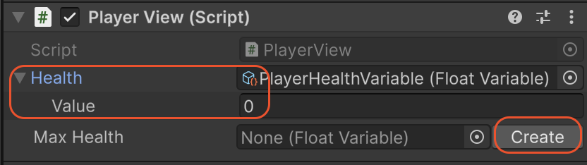

# Utilities & Editor Tooling

Beyond its core architectural features, SOAR includes a collection of utilities and custom editor enhancements designed to improve workflow, reduce boilerplate code, and make debugging easier.

---

## Editor Tooling

SOAR's editor scripts provide significant quality-of-life improvements directly within the Unity Inspector.

### In-Inspector Action Buttons

Most SOAR assets have custom inspectors that feature action buttons for debugging and testing.

*   **`GameEvent`:** A "Raise" button is provided to trigger the event directly from the Inspector. This is invaluable for testing `UnityEventBinder` setups or other listeners without needing to run the game or write test code.
*   **`Command`:** An "Execute" button allows the command's logic to be run at any time.
*   **`Transaction`:** A "Request" button triggers the transaction. If no response handler is registered, a temporary, empty handler is created to ensure the request can complete without errors. For typed transactions, the request can be sent with the value currently entered in the Inspector.

These buttons allow for rapid testing of isolated logic in both Edit Mode and Play Mode.

### Json File Management

Any variable that inherits from `JsonableVariable<T>` gains a "Json File Management" section in its Inspector. This tooling provides a no-code way to manage data persistence.

*   **Save to Json:** The variable's current value is serialized and saved to a specified file path.
*   **Load from Json:** The variable's value is overwritten with the data from the specified JSON file.
*   **Path and Filename:** The save location (`Application.dataPath`, `persistentDataPath`, or a custom path) and filename can be configured directly in the Inspector.

### Extended ScriptableObject Drawer

To reduce the need to click between assets, any field that references a SOAR asset (e.g., a `GameEvent` field on a `MonoBehaviour`) will automatically draw the properties of that asset directly inline.



This feature makes it easy to see and modify the values of variables or the contents of collections without ever leaving the component that uses them.

Additionally, if an asset field is empty (`null`), a "Create" button will be displayed, allowing for the creation and saving of a new asset instance on the fly.

---

## Runtime Utilities

These helper classes are available to be used in runtime scripts.

### `MenuHelper`

This static class contains the default menu paths used by SOAR's built-in assets (e.g., `MenuHelper.DefaultVariableMenu` resolves to `"SOAR/Variables/"`).

When creating custom assets, this class should be used in the `[CreateAssetMenu]` attribute to ensure custom assets appear in the same organized sub-menus as the default ones.

```csharp
[CreateAssetMenu(fileName = "NewPlayerDataVariable", 
                 menuName = MenuHelper.DefaultVariableMenu + "Player Data")]
public class PlayerDataVariable : Variable<PlayerData> { }
```

### `JsonableExtensions`

For `IJsonable` objects (like `JsonableVariable<T>`), this class provides the programmatic counterparts to the Inspector tooling.

*   `SaveToJson(path, filename)`: Saves the object's data to a file.
*   `LoadFromJson(path, filename)`: Loads the object's data from a file.
*   `IsJsonFileExist(path, filename)`: Checks if a saved file already exists.

These extension methods are useful for creating dedicated `SaveManager` or `LoadManager` systems.

### `CompositeDisposable`

This utility class manages a collection of `IDisposable` objects. It is used internally by SOAR's non-R3 implementation to track all active subscriptions. When the `CompositeDisposable` is disposed, all the subscriptions it holds are disposed of as well. It can be useful in user scripts for managing multiple subscriptions in a single `MonoBehaviour`.
