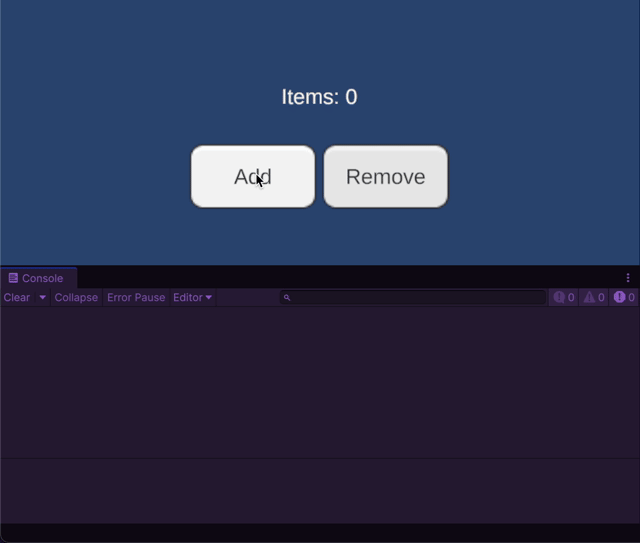

# R3 Integration: Collection

R3 integration makes SOAR's `Collection` assets fully reactive, providing `Observable` streams for every type of modification. This allows for precise and declarative handling of collection changes.

## Observable Streams

Both `SoarList<T>` and `SoarDictionary<TKey, TValue>` expose a rich set of `Observe...()` methods:

-   **`ObserveAdd()`**: Emits the item that was added.
-   **`ObserveRemove()`**: Emits the item that was removed.
-   **`ObserveClear()`**: Emits a `Unit` notification when the collection's `Clear()` method is called.
-   **`ObserveCount()`**: Emits the new `Count` of the collection whenever it changes.
-   **`ObserveValues()`**: Emits a notification when an existing element's value is changed.
    -   For `SoarList<T>`, this emits an `IndexValuePair<T>`.
    -   For `SoarDictionary<TKey, TValue>`, this emits a `KeyValuePair<TKey, TValue>`.

`SoarList<T>` has additional streams for list-specific operations:
-   **`ObserveMove()`**: Emits a `MovedValueDto<T>` containing the value, old index, and new index.
-   **`ObserveInsert()`**: Emits an `IndexValuePair<T>` when an item is inserted at a specific index.

## Async/Await Support

Every `Observe...()` method has a corresponding `On...Async()` or `...Async()` counterpart that returns a `ValueTask`.
This allows you to `await` the next specific change in a collection.

-   **`OnAddAsync()`**: Awaits the next added item.
-   **`OnRemoveAsync()`**: Awaits the next removed item.
-   **`OnClearAsync()`**: Awaits the next `Clear()` operation.
-   **`CountAsync()`**: Awaits the next change in the collection's `Count`.
-   **`ValuesAsync()`**: Awaits the next change to an element's value.

For `SoarList<T>`:
-   **`OnMoveAsync()`**: Awaits the next move operation.
-   **`OnInsertAsync()`**: Awaits the next insert operation.

## Example

This example demonstrates how to use the observable streams to monitor an inventory list.

```csharp
// File: InventoryMonitor.cs
using R3;
using Soar.Collections;
using UnityEngine;
using UnityEngine.UI;

public class InventoryMonitor : MonoBehaviour
{
    [SerializeField] private StringList inventoryItems;
    [SerializeField] private Text inventoryCountText;
    [SerializeField] private Button addItemButton;
    [SerializeField] private Button removeItemButton;

    void Start()
    {
        // --- Subscriptions ---

        // Update UI when an item is added
        inventoryItems.ObserveAdd()
            .Subscribe(newItem => Debug.Log($"+ Added '{newItem}' to inventory."))
            .AddTo(this);

        // Update UI when an item is removed
        inventoryItems.ObserveRemove()
            .Subscribe(removedItem => Debug.Log($"- Removed '{removedItem}' from inventory."))
            .AddTo(this);

        // Update the count text whenever the count changes
        inventoryItems.ObserveCount()
            .Subscribe(newCount => inventoryCountText.text = $"Items: {newCount}")
            .AddTo(this);

        // --- Button Actions ---
        addItemButton.OnClickAsObservable()
            .Subscribe(_ => inventoryItems.Add($"Item_{Random.Range(1, 100)}"))
            .AddTo(this);

        removeItemButton.OnClickAsObservable()
            .Where(_ => inventoryItems.Count > 0)
            .Subscribe(_ => inventoryItems.RemoveAt(0))
            .AddTo(this);

        // --- Initial State ---
        inventoryCountText.text = $"Items: {inventoryItems.Count}";
    }
}
```
**Testing the script:**
1.  Attach the `InventoryMonitor` script to a GameObject.
2.  Create a `StringList` asset and assign it to the `inventoryItems` field.
3.  Assign UI elements (Text and Buttons) to the corresponding fields.
4.  Enter Play Mode. Clicking the buttons will add or remove items, and the console will log the changes as they happen.


