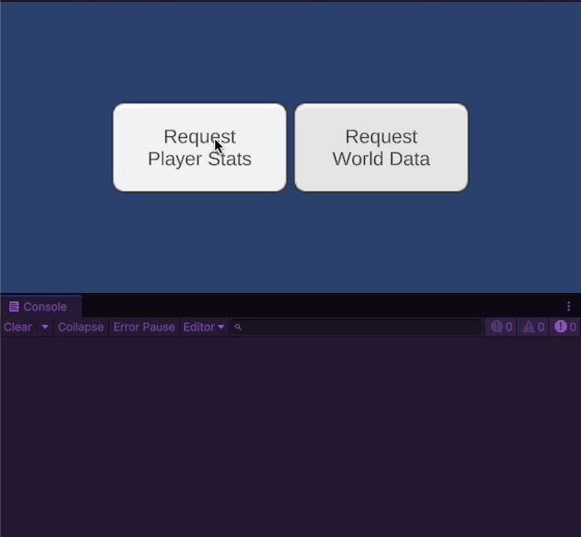

# R3 Integration: Transaction

The R3 integration supercharges SOAR's `Transaction` system, providing robust tools for handling asynchronous request-response cycles and managing concurrency.

## Core R3 Features for Transactions

-   **`AsRequestObservable()` / `AsResponseObservable()`**: These methods return `Observable` streams that allow you to reactively listen for when requests are made or when responses are returned.
-   **`RequestAsync()`**: This is the primary method for making asynchronous requests. It returns a `ValueTask` (or `ValueTask<TResponse>`) that completes when the registered response handler finishes its work.
-   **Asynchronous `RegisterResponse`**: The most powerful feature is the ability to register `async` methods as response handlers. You can use `Func<ValueTask>`, `Func<TRequest, ValueTask<TResponse>>`, and other async delegates.

## Concurrency with `AwaitOperation`

When registering an asynchronous response, you can specify an `AwaitOperation` to control how the `Transaction` behaves if multiple requests arrive while a response is still being processed.

-   **`Parallel`**: (Default) Processes all incoming requests concurrently. Use this if the order of responses doesn't matter and the operations are independent.
-   **`Sequential`**: Queues incoming requests and processes them one at a time, in the order they were received. This is ideal for operations that must not overlap, like writing to a file.
-   **`Drop`**: If a request is already in progress, any new requests that arrive are simply ignored. Useful for preventing button-mashing.
-   **`Switch`**: If a new request arrives, the operation for the previous, unfinished request is cancelled, and the new one begins. Perfect for operations like auto-complete search, where you only care about the latest input.
-   **`ThrottleFirst`**: Allows only the first request within a given time window to be processed, ignoring subsequent ones until the window resets.

### Example

This example demonstrates a `Transaction` that simulates fetching data from a web service, using `AwaitOperation.Sequential` to ensure that requests are handled one by one.

```csharp
// File: WebService.cs
using System.Threading.Tasks;
using Soar.Transactions;
using UnityEngine;

public class WebService : MonoBehaviour
{
    [SerializeField] private StringTransaction fetchDataTransaction;

    private void Start()
    {
        // Register an async response handler that simulates a web request
        fetchDataTransaction.RegisterResponse(ResponseHandlerAsync, R3.AwaitOperation.Sequential); // Process requests one by one
    }

    private async ValueTask<string> ResponseHandlerAsync(string request)
    {
        Debug.Log($"[WebService] Received request for: '{request}'. Starting fetch...");
        await Task.Delay(1500); // Simulate network latency
        var responseData = $"JSON data for '{request}'";
        Debug.Log("[WebService] Fetch complete. Returning data.");
        return responseData;
    }
}
```

```csharp
// File: DataRequester.cs
using System.Threading;
using System.Threading.Tasks;
using Soar.Transactions;
using UnityEngine;
using R3;
using UnityEngine.UI;

public class DataRequester : MonoBehaviour
{
    [SerializeField] private StringTransaction fetchDataTransaction;
    [SerializeField] private Button requestPlayerStatsButton;
    [SerializeField] private Button requestWorldDataButton;

    private void Start()
    {
        requestPlayerStatsButton.OnClickAsObservable()
            .SubscribeAwait(OnRequestPlayerStatsButtonPressed)
            .AddTo(this);

        requestWorldDataButton.OnClickAsObservable()
            .SubscribeAwait(OnRequestWorldDataButtonPressed)
            .AddTo(this);
    }

    private async ValueTask OnRequestPlayerStatsButtonPressed(Unit _, CancellationToken token)
    {
        Debug.Log("[Requester] Requesting Player Stats...");
        var result = await fetchDataTransaction.RequestAsync("PlayerStats", token);
        Debug.Log($"[Requester] Received response: '{result}'");
    }
    
    private async ValueTask OnRequestWorldDataButtonPressed(Unit _, CancellationToken token)
    {
        Debug.Log("[Requester] Requesting World Data...");
        var result = await fetchDataTransaction.RequestAsync("World Data", token);
        Debug.Log($"[Requester] Received response: '{result}'");
    }
}
```

**Expected Output**

If you click both buttons quickly, the output will look like this, demonstrating the sequential processing:
```
[Requester] Requesting Player Stats...
[WebService] Received request for: 'PlayerStats'. Starting fetch...
[Requester] Requesting World Data...
[WebService] Fetch complete. Returning data.
[Requester] Received response: 'JSON data for 'PlayerStats''
[WebService] Received request for: 'WorldData'. Starting fetch...
[WebService] Fetch complete. Returning data.
[Requester] Received response: 'JSON data for 'WorldData''
```


